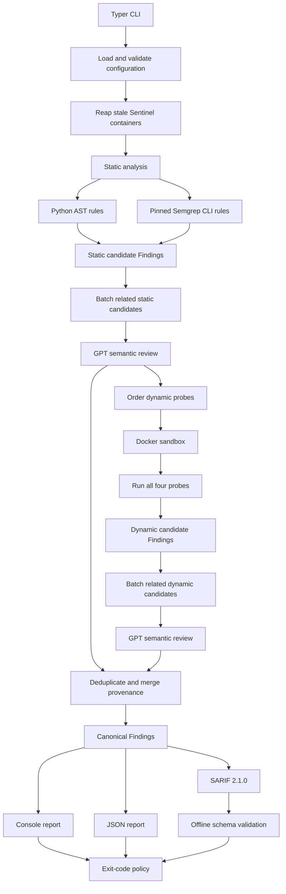
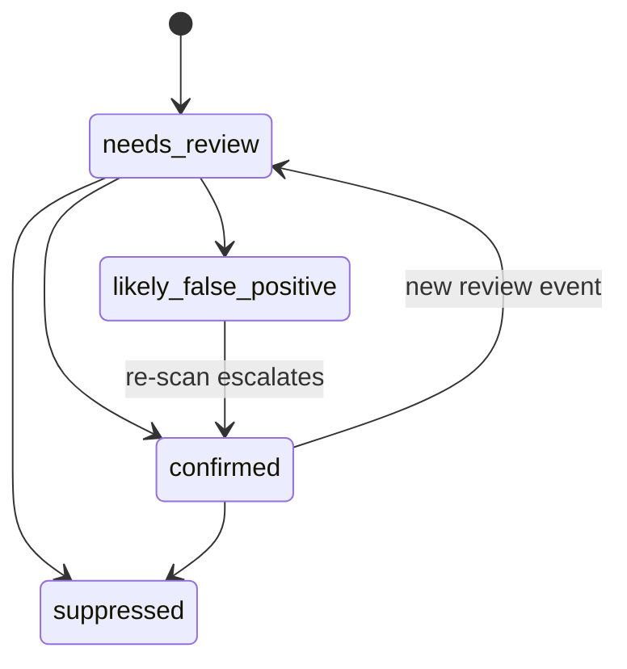
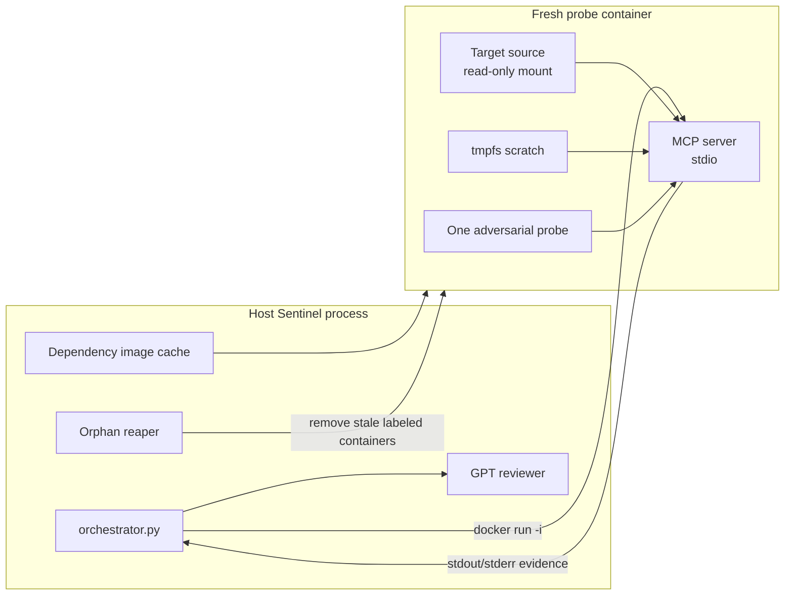

# MCP Sentinel Architecture

## 1. Purpose and status

This document is the approved architecture baseline for MCP Sentinel. It is concrete enough to guide implementation across sessions, but paths marked **planned** do not exist until their roadmap phase is complete.

MCP Sentinel is the build-time security plane of SecureMCP. It scans an MCP server before deployment, combines deterministic static analysis with sandboxed dynamic probes, requires GPT semantic review in the normal pipeline, and emits one auditable Finding shape to console, JSON, and SARIF 2.1.0 outputs.

SecureMCP Gateway and SecureMCP Identity remain separate repositories and are outside this architecture.

## 2. v1 scope

### Supported

- Local repository paths only.
- Python MCP servers using Python 3.10, 3.11, or 3.12.
- The official Python MCP SDK and FastMCP.
- MCP over stdio.
- Static analysis using a custom Python AST engine plus a pinned Semgrep CLI.
- Dynamic analysis inside Docker.
- Required GPT-5.6 Sol semantic review of deterministic candidates through the Responses API.
- Console, JSON, and SARIF 2.1.0 reporting.
- A composite GitHub Action on `ubuntu-latest`.

Python 3.12 is the primary development and CI version. Python 3.10 is the compatibility floor. If the target does not specify a compatible version through `pyproject.toml`, `.python-version`, or its Sentinel target configuration, the sandbox defaults to Python 3.11.

### Deferred or unsupported

- Remote repository cloning and scanning.
- Externally hosted or user-supplied running endpoints.
- Streamable HTTP transport in v1.
- Legacy SSE transport.
- Custom or hand-rolled MCP implementations beyond best-effort static parsing.
- Multi-language analysis.
- Free-standing GPT-originated findings.
- General exploit confirmation against arbitrary user targets.
- Automated patch generation and automated pull requests.

Unsupported target types, frameworks, transports, and configuration values fail explicitly with exit code `2`.

## 3. Architectural invariants

1. Static analysis never imports or executes target code.
2. Dynamic analysis is enabled by default and runs only inside Docker.
3. Target source is mounted read-only and the host filesystem is otherwise unavailable to target code.
4. Runtime containers have no credentials and no external network or DNS access.
5. GPT review runs in the host-side Sentinel process. `OPENAI_API_KEY` is never forwarded to target installation or runtime containers.
6. GPT can annotate or reclassify a deterministic candidate, but it cannot create or silently delete a finding in v1.
7. Every finding remains traceable to a stable deterministic rule ID.
8. One canonical Finding model is shared by static analysis, dynamic analysis, GPT review, console output, JSON output, and SARIF output.
9. Severity is reproducible from `impact` and `exploitability`; GPT severity suggestions are advisory only.
10. A failed engine, review, sandbox, or SARIF validation is never reported as a clean scan.
11. Rules and probes do not require live access to third-party services. The SARIF schema and GPT test responses are stored locally.
12. Symlinks are not followed, and the scan root is a hard filesystem boundary.
13. GPT output uses strict Structured Outputs derived from the Pydantic review schema; free-form JSON is not accepted.
14. OpenAI requests use `store: false`, transmit the minimum redacted context, and record the actual returned model and usage metadata.

## 4. End-to-end scan pipeline



The normal order is:

1. Load configuration and validate the target.
2. Remove stale Sentinel-labeled containers.
3. Run both static engines.
4. Batch related static candidates by tool or file and review them with GPT.
5. Use the validated GPT probe plan only to reorder and safely parameterize, never skip, the dynamic probes.
6. Run all four dynamic probes in fresh ephemeral containers.
7. Batch related dynamic candidates and review them with GPT.
8. Deduplicate root causes and merge provenance.
9. Render reports, validate SARIF, and apply the exit-code policy.

`--static-only` skips target launch configuration, orphan reaping, Docker, and probes. It does not skip GPT review of static candidates. `--allow-degraded` permits unreviewed static or dynamic results when GPT is unavailable; without it, GPT failure is fatal.

## 5. Planned repository layout

The build brief's repository tree is the approved baseline, extended only by paths required by the accepted contracts.

```text
.
├── action.yml
├── LICENSE
├── Makefile
├── pyproject.toml
├── README.md
├── AGENTS.md
├── ARCHITECTURE.md
├── ROADMAP.md
├── sentinel.toml
├── schemas/
│   ├── finding.schema.json
│   ├── report.schema.json
│   └── sarif-2.1.0.schema.json
├── artifacts/
│   ├── example.sarif
│   └── gpt-ablation.json
├── scripts/
│   └── reap_orphans.py
├── src/
│   └── sentinel/
│       ├── cli.py
│       ├── config.py
│       ├── finding.py
│       ├── schema.py
│       ├── orchestrator.py
│       ├── owasp_mapping.py
│       ├── static/
│       │   ├── engine.py
│       │   ├── semgrep_adapter.py
│       │   └── rules/
│       ├── dynamic/
│       │   ├── prober.py
│       │   └── sandbox.py
│       ├── llm/
│       │   ├── schema.py
│       │   ├── semantic_reviewer.py
│       │   └── exploit_confirm.py
│       └── report/
│           ├── console.py
│           ├── sarif.py
│           └── validate_sarif.py
├── tests/
│   ├── fixtures/
│   │   ├── vulnerable_server/
│   │   └── clean_server/
│   ├── evals/
│   │   └── gpt_review_cases.yaml
│   └── test_rules/
└── demo/
    └── vulnerable_server/
```

Key ownership boundaries:

- `cli.py` is a thin Typer argument-parsing shell.
- `orchestrator.py` owns phase ordering and failure propagation.
- `config.py` loads, merges, and validates CLI, environment, scanner, and target configuration.
- `finding.py` owns the canonical Pydantic Finding model and severity calculation.
- `schemas/finding.schema.json` is generated from `finding.py` with `model_json_schema()` and checked in for external consumers. It is not hand-maintained.
- `schemas/report.schema.json` is generated from the native report model and references `finding.schema.json` through an offline relative `$ref`.
- `schema.py` owns deterministic `python -m sentinel.schema generate|check` commands. Hatchling force-includes the root schemas as installed package resources without a second checked-in copy.
- `static/` never imports from `dynamic/`, and `dynamic/` never imports from `static/`.
- Both producers depend on `finding.py`; report modules consume the same model.
- `llm/schema.py` defines the validated semantic-review response.
- `tests/evals/gpt_review_cases.yaml` is the versioned truth set for measuring rules-only, GPT-reviewed, and dynamically confirmed behavior.
- `artifacts/gpt-ablation.json` is a generated evaluation artifact, not hand-authored evidence.
- `report/validate_sarif.py` owns offline SARIF validation.
- `llm/exploit_confirm.py` is Phase 6 stretch work and is not part of the required pipeline.

## 6. Canonical Finding model

The planned Pydantic model at `src/sentinel/finding.py` is authoritative. Its generated external schema is `schemas/finding.schema.json`.

### Required fields

| Field | Contract |
|---|---|
| `finding_id` | UUID unique to one finding instance in one scan run. |
| `dedup_key` | Stable content hash for matching the same root cause across scans. |
| `rule_id` | Stable rule identifier such as `SENT-003`. |
| `title` | Short human-readable finding title. |
| `description` | Explanation of the detected security issue. |
| `impact` | `Critical`, `High`, `Medium`, `Low`, or `Informational`. |
| `exploitability` | `confirmed`, `likely`, or `theoretical`. |
| `severity` | Calculated from impact and exploitability. |
| `confidence` | Normalized `high`, `medium`, or `low`. |
| `status` | `needs_review`, `confirmed`, `likely_false_positive`, or `suppressed`. |
| `owasp_category` | Pinned `ASI0X:2026` identifier and canonical category name. |
| `source` | Origin only: `static` or `dynamic`. GPT never overwrites it. |
| `location` | File plus line/column range, or a tool/schema path. |
| `evidence` | Structured evidence appropriate to the originating detector. |
| `remediation` | Actionable mitigation guidance. |
| `scan_id` | Identifier shared by all findings from one scan. |
| `timestamp` | Finding creation timestamp. |
| `provenance` | Array of `{source, rule_id, evidence, timestamp}` entries. |
| `review` | Nested GPT audit record containing mode, returned model, raw confidence, reasoning, grounded evidence references, probe plan, advisory severity, usage, latency, and review time. |

Static evidence contains a code snippet and line range. Dynamic evidence contains probe IDs, redacted request/response payloads, and logs. Secret values are redacted before evidence is stored.

### Identity and deduplication

- `finding_id` is a per-scan UUID and is never used for cross-scan matching.
- A static `dedup_key` hashes `(rule_id, file_path, normalized_location)`.
- A dynamic `dedup_key` also includes `probe_id`.
- Repeated deduplication keys update the existing finding's status and timestamp rather than creating duplicate rows.
- When `SENT-009` or `SENT-011` confirms an existing `SENT-003` root cause, the merged finding keeps `rule_id=SENT-003` and `source=static`; the dynamic result is appended to `provenance` and evidence.
- Without an existing `SENT-003`, `SENT-009` and `SENT-011` remain separate findings.
- `SENT-008` and `SENT-010` always remain distinct root causes.

### Status lifecycle

Every finding starts in `needs_review`.



Suppression always records reasoning. A finding cannot transition directly from `confirmed` to `likely_false_positive`; it must return to `needs_review` through a review event first.

The semantic reviewer emits only `confirmed`, `suppressed`, or `needs_review`. `likely_false_positive` is reserved for the Phase 6 exploit-confirmation layer.

### Severity calculation

Rule metadata supplies impact. Exploitability adjusts the emitted severity:

| Exploitability | Severity calculation |
|---|---|
| `confirmed` | Severity equals impact. |
| `likely` | Severity equals impact. |
| `theoretical` | Severity is one level below impact. |

The downward mapping is `Critical → High → Medium → Low → Informational`, with `Informational` as the floor. Missing exploitability is treated as `theoretical`.

Exploitability is assigned as follows:

- A dynamic proof or observed canary side effect is `confirmed`.
- A static match corroborated by GPT with review status `confirmed` is `likely`.
- A static match that is unreviewed, degraded, suppressed, or still `needs_review` is `theoretical`.

GPT's `suggested_severity_override` is persisted in `review` but never changes severity automatically.

## 7. OWASP mapping

Every rule is pinned to the OWASP Top 10 for Agentic Applications 2026 taxonomy. Existing rule mappings do not silently change when OWASP publishes a later edition.

| ID | Category |
|---|---|
| `ASI01:2026` | Agent Goal Hijack |
| `ASI02:2026` | Tool Misuse & Exploitation |
| `ASI03:2026` | Identity & Privilege Abuse |
| `ASI04:2026` | Agentic Supply Chain Vulnerabilities |
| `ASI05:2026` | Unexpected Code Execution |
| `ASI06:2026` | Memory & Context Poisoning |
| `ASI07:2026` | Insecure Inter-Agent Communication |
| `ASI08:2026` | Cascading Failures |
| `ASI09:2026` | Human-Agent Trust Exploitation |
| `ASI10:2026` | Rogue Agents |

`src/sentinel/owasp_mapping.py` is the canonical rule-to-category mapping in source.

## 8. Static analysis

### Hybrid engine

`src/sentinel/static/engine.py` coordinates two deterministic engines:

- Custom AST rules own MCP-specific semantics: declared scopes versus handler behavior, schemas, prompt flow, auth dependencies, and manifest integrity.
- `src/sentinel/static/semgrep_adapter.py` invokes the pinned Semgrep CLI as a subprocess for generic code patterns such as unsafe execution/deserialization and hardcoded secrets.

Semgrep is a required `[project.dependencies]` dependency, not a development-only or optional extra. Sentinel checks the installed Semgrep version at startup. Static analysis never imports target modules.

### Initial permanent rule catalog

| ID | Detection boundary | OWASP | Impact | False-positive risk | Fixture acceptance |
|---|---|---|---|---|---|
| `SENT-001` | Filesystem or network scope is broader than the handler actually uses. | `ASI03:2026` | High | Medium: some tools are legitimately broad. | Vulnerable fixture has a broad grant with narrow use. Clean fixture has matched scope and a justified legitimately broad tool. |
| `SENT-002` | `eval`, `exec`, `pickle.loads`, unsafe `yaml.load`, or a subprocess command is built from raw tool arguments. | `ASI05:2026` | Critical | Low. | Vulnerable fixture passes a raw argument to `eval`. Clean fixture uses `ast.literal_eval` or a fixed allowlist. |
| `SENT-003` | No schema or model validates a tool handler's parameters before use. | `ASI02:2026` | Medium | Medium. | Vulnerable fixture reads unchecked keyword arguments. Clean fixture validates with Pydantic or JSON Schema first. |
| `SENT-004` | Tool output or description is re-interpolated into a later prompt without sanitization. | `ASI01:2026` | High | Medium–High; this heuristic is documented as best effort. | Vulnerable fixture interpolates directly. Clean fixture passes content through a defined sanitizer. |
| `SENT-005` | Regex or entropy-based secret scanning matches source or configuration. | `ASI03:2026` | Critical | Low–Medium because entropy checks can match benign values. | Vulnerable fixture contains a hardcoded key. Clean fixture reads from `os.environ`. |
| `SENT-006` | An HTTP route has no auth middleware, or its auth check is a no-op. | `ASI03:2026` | High | Low. | Vulnerable fixture lacks an auth dependency. Clean fixture verifies bearer or session authentication. |
| `SENT-007` | A tool manifest loader accepts a manifest without signature verification or hash pinning. | `ASI04:2026` | Medium | Low. | Vulnerable fixture has no integrity check. Clean fixture verifies a signature or pinned hash. |

Rule IDs become permanent when committed and are never renumbered or reassigned.

### Rule acceptance gate

Each rule must have:

1. A vulnerable fixture that triggers it.
2. A clean fixture that does not trigger it, including relevant false-positive controls.
3. An explicit `ASI0X:2026` category justification.
4. A written false-positive risk statement.
5. An impact rating evaluated through the fixed severity rubric.
6. Proof that the detector executes no target code.
7. A completed rule-review checklist before merge.

For `SENT-005`, `[rules.SENT-005]` in `sentinel.toml` can allowlist file-path globs and SHA-256 fingerprints of matched secret values. Plaintext secrets and free-form regex allowlisting of secret values are prohibited.

## 9. GPT semantic review

### Role and authority

GPT-5.6 review is required in the normal pipeline and processes both static and dynamic candidates. It may:

- Set an allowed review status.
- Reassess confidence.
- Record reasoning.
- Cite the exact supplied code/schema evidence supporting its judgment.
- Produce a constrained plan that orders and parameterizes the four approved dynamic probe templates.
- Suggest a severity override for human or later automated review.

It may not create a finding without a deterministic rule, change the finding's origin, silently delete a finding, automatically change severity, skip a required probe, invent a probe ID, emit executable probe code, or reference evidence outside the supplied context.

### API and model contract

The reviewer uses the OpenAI Responses API with the explicit `gpt-5.6-sol` model. The requested model, actual returned `response.model`, and reasoning effort are recorded separately so a model alias or backend revision cannot silently change audit history.

- Default reasoning effort: `medium`.
- Evaluation comparison: `medium` versus `low` on the versioned review cases.
- Pro mode is not part of the required pipeline unless a later measured evaluation justifies it.
- Requests set `store: false` because scanned source may be proprietary.
- The integration uses strict Structured Outputs generated from the Pydantic models in `src/sentinel/llm/schema.py`.
- Refusals, incomplete responses, schema violations, and unsupported response item types follow the documented retry and failure policy; they are never coerced into a valid review.
- Programmatic Tool Calling and multi-agent mode are not dependencies of the required pipeline. They may be evaluated later without changing the baseline review contract.

### Request boundary

The host-side reviewer calls GPT-5.6 using `OPENAI_API_KEY`. Each request contains only:

- Finding and rule IDs.
- Tool schema and description.
- Flagged source snippet with a small surrounding window.
- Repository-relative locations.
- The fixed rule definition, OWASP mapping, impact, and allowed status transitions.
- The four approved probe IDs and their non-executable template contracts when a static review can influence probe order.

Anything matched as a secret by `SENT-005` and all absolute paths are redacted before transmission.

Related candidates are grouped by tool or file so GPT can reason about one local security boundary in one call. Batching reduces API calls and exposes relationships such as a missing schema plus unsafe use of the same argument. Cached per-finding reviews are removed before batching; the response still returns one independently auditable review keyed by each `finding_id`.

### Validated response

`src/sentinel/llm/schema.py` supplies the strict Structured Outputs schema and validates the parsed response. A representative response is:

```json
{
  "reviews": [
    {
      "finding_id": "4d9be89f-73a8-4f9f-b46d-d8b63850be8a",
      "status": "confirmed",
      "confidence": 0.91,
      "reasoning": "The handler consumes limit before any schema validation.",
      "evidence_refs": [
        {
          "path": "server.py",
          "start_line": 42,
          "end_line": 48,
          "claim": "Unvalidated tool input reaches the handler logic."
        }
      ],
      "probe_plan": {
        "ordered_probe_ids": ["SENT-011", "SENT-009", "SENT-010", "SENT-008"],
        "target_tool": "search_records",
        "argument_bindings": {
          "SENT-011": {"limit": "__SENTINEL_WRONG_TYPE__"}
        }
      },
      "suggested_severity_override": null
    }
  ]
}
```

The review status enum remains exactly `confirmed | suppressed | needs_review`. Dynamic-candidate reviews set `probe_plan` to `null` because the probes have already run.

Host-side validation additionally enforces:

- Every requested `finding_id` appears exactly once and no unknown ID appears.
- Every evidence path and line range exists inside the redacted context supplied for that finding.
- `ordered_probe_ids` contains each of `SENT-008` through `SENT-011` exactly once.
- `target_tool` is a tool discovered in the target's supplied schema.
- Argument bindings are limited to fields declared by the target tool and inert values accepted by the approved probe template.
- The model cannot provide shell, Python, SQL, or other executable probe programs.

After validation, `semantic_reviewer.py` adds the requested model, returned `response.model`, review mode (`live`, `replay`, or `degraded`), and `reviewed_at` timestamp. The raw numeric confidence remains in the nested review record. Top-level confidence is updated to:

- `high` for values at or above `0.8`.
- `medium` for values from `0.5` through `0.79`.
- `low` for values below `0.5`.

Before review, deterministic candidates default to top-level confidence `high`.

### Grounded probe planning

Probe planning makes GPT operationally consequential without granting it arbitrary execution authority:

1. Static rules produce deterministic candidates.
2. GPT grounds its judgment in supplied evidence references.
3. GPT orders all four fixed probe IDs and binds safe template fields to the relevant target tool schema.
4. Sentinel validates the plan independently.
5. The Docker prober executes every required template under the existing sandbox limits.
6. Dynamic evidence is merged back into the deterministic finding.

An invalid plan does not remove or skip probes. Sentinel falls back to the fixed default order, records the plan validation failure, and preserves the original candidate for review.

### Operational limits

- 30-second request timeout.
- Two retries with backoff.
- At most five concurrent requests.
- Default `max_findings_per_scan = 500`, configurable through `sentinel.toml`.
- The cap limits findings, not API calls; related cache misses are batched by tool or file.
- Per-finding cache key: `(rule_id, snippet_hash, schema_hash)`.
- Candidates beyond the cap remain `needs_review`; they are never dropped. The console and report summary warn that review was truncated.
- Reaching the configured cap is expected volume control, not an internal failure, and does not produce exit code `3`.
- Stable prompt and rule prefixes are kept separate from dynamic request data so prompt caching remains measurable. Explicit cache breakpoints are adopted only after the evaluation shows a benefit.
- Recorded real-response fixtures are replayed in CI; CI does not make live GPT calls.

Each live batch records:

- Requested and returned model identifiers.
- Reasoning effort and review mode.
- Finding and batch counts.
- Input, output, reasoning, cached, and cache-write tokens when returned by the API.
- End-to-end latency, retries, refusal/incomplete state, and schema-validation outcome.
- Cache hits and misses.
- Counts of confirmed, suppressed, and still-needs-review findings.

Aggregate telemetry appears in console/JSON summaries and SARIF invocation properties. It contains no source snippets, secrets, or absolute paths.

GPT unavailability is exit code `3` by default. With `--allow-degraded`, the finding stays `needs_review` and receives:

```json
{
  "reviewed": false,
  "reason": "GPT unavailable — degraded mode"
}
```

Forked GitHub pull requests automatically use degraded mode when secrets are unavailable and clearly annotate the skipped review.

### Evaluation and ablation

`tests/evals/gpt_review_cases.yaml` contains representative true positives, seeded false positives, ambiguous cases, and probe-prioritization cases. The same versioned cases run through three treatments:

1. Deterministic rules only.
2. Deterministic rules plus GPT review.
3. Deterministic rules plus GPT review plus dynamic proof.

The generated `artifacts/gpt-ablation.json` reports true positives, false positives, precision, recall where the fixture truth set permits it, status transitions, structured-output validity, evidence-reference validity, probe-plan validity, latency, tokens, cache behavior, and cost per successfully reviewed finding. Cost estimates record the requested and returned model, pricing source, and pricing-as-of date; if authoritative pricing is unavailable, the artifact reports token usage without inventing a monetary estimate. The ablation also compares `medium` and `low` reasoning effort without changing the production default until results justify it.

The evaluation must demonstrate at least one corroborated true positive, one grounded suppression that remains visible, one ambiguous `needs_review` outcome, and one correctly prioritized dynamic probe. This is the evidence that GPT-5.6 improves the scanner rather than merely rewriting deterministic output.

### Judge replay mode

The normal scan and default `sentinel demo` path use live GPT review. `sentinel demo --replay-review` is a separate, visibly labeled judge/offline path that replays the checked-in response cassettes through the same parser, validation, merge, and reporting code.

Replay results set `review.mode = "replay"`, display a prominent console/SARIF annotation, and can never be represented as a live model call. Replay mode exists for reproducible testing without an API key; the submission also includes artifacts and video evidence from a real live GPT-5.6 run.

## 10. Dynamic analysis and Docker isolation

### Isolation boundary



### Target contract

Dynamic scans require either a valid `sentinel.target.yaml` or a `--target-launch-cmd` override. An ordinary scan without target launch configuration exits with code `2`. `--static-only` is the sole exception.

`sentinel.target.yaml` owns target execution settings:

- `language`
- `launch_cmd`
- optional `install_cmd`
- `transport`
- `working_dir`
- `env` for literal non-secret values
- `env_from` for explicitly named host variables
- optional `python_version`

Only `transport: stdio` is accepted in v1. `http`, `port`, SSE, and other transport values are rejected during configuration loading.

`env_from` rejects names matching secret-oriented deny patterns such as `SECRET`, `KEY`, `TOKEN`, `PASSWORD`, or `CREDENTIAL`. No credentials are allowed in dependency-install or probe containers. `OPENAI_API_KEY` is always host-side and is explicitly excluded from `env_from`.

### Dependency image

- The cached image contains dependencies only; target source is never baked into it.
- `install_cmd` may install dependencies but may not install the target package itself.
- When `install_cmd` is absent, Sentinel infers dependency installation from `requirements.txt`, `pyproject.toml`, or a Poetry lockfile.
- Package build scripts may run only inside the build container.
- Build-time network is restricted to registries listed in `[sandbox].allowed_registries`.
- The default registry allowlist is `pypi.org` and `files.pythonhosted.org`.
- Credentials are never passed to the build.
- The cache key hashes Python version, install command, Sentinel version, and dependency-lockfile hash.

### Probe runtime

Each probe gets a fresh ephemeral container from the dependency image so state cannot persist between probes.

- Target source: read-only mount.
- Scratch space: ephemeral tmpfs.
- Host filesystem: inaccessible outside the target mount.
- Communication: `docker run -i` over stdin/stdout only.
- Network: external egress and DNS denied.
- Environment: host environment stripped; only validated `env` and `env_from` values passed.
- Privilege: `--security-opt=no-new-privileges`.
- Processes: `--pids-limit=64` and one process tree.
- CPU: 1 CPU.
- Memory: 512 MB.
- Per-probe wall-clock timeout: 10 seconds.
- Full dynamic-pass timeout: 120 seconds.
- Cleanup: automatic container removal plus `try/finally` force cleanup.

`scripts/reap_orphans.py` runs at the beginning of every dynamic invocation and force-removes Sentinel-labeled scan containers older than 120 seconds. Docker unavailability, startup failure, probe infrastructure failure, or cleanup failure is exit code `3`; Sentinel never silently falls back to static-only.

### Required probes

| ID | Probe | Safe behavior | Finding behavior | OWASP | Impact |
|---|---|---|---|---|---|
| `SENT-008` | Call a tool not granted to the session. | Reject before execution. | The tool executes. | `ASI02:2026` | Critical |
| `SENT-009` | Send a grossly oversized argument. | Reject on size or schema. | Accept, hang, or crash. | `ASI05:2026` | Medium |
| `SENT-010` | Send shell, SQL, or template-injection strings. | Treat them as inert data. | Observe a canary side effect such as a Sentinel scratch file. | `ASI05:2026` | Critical |
| `SENT-011` | Omit a required field or send the wrong type. | Reject with a validation error. | Process without error. | `ASI02:2026` | Low |

The validated GPT probe plan may reorder and bind approved inert template values for these probes. Sentinel independently validates the target tool, field names, values, and probe set; all four probes run even when the plan is absent or invalid.

## 11. Configuration and CLI

### Configuration sources

Precedence is:

1. CLI arguments.
2. `SENTINEL_*` environment variables.
3. Target-root `sentinel.toml`.
4. Built-in defaults.

`sentinel.toml` contains scanner settings only: rule selection, fail threshold, ignore paths, output format, LLM limits, sandbox registry allowlist, and the optional path to a non-default target configuration. It never duplicates launch or installation settings.

The scanner respects the target repository's `.gitignore` and always excludes `.venv/`, `venv/`, `node_modules/`, `__pycache__/`, and `.git/`. It does not follow symlinks or access paths above the scan root.

### CLI

Typer is the sole CLI framework. The main command is:

```text
sentinel scan <path>
```

The judge/demo command is:

```text
sentinel demo [--replay-review]
```

`sentinel demo` runs the complete live pipeline against the bundled vulnerable fixture. `--replay-review` replaces only the live Responses API calls with clearly labeled recorded responses; it still exercises schema validation, probe planning, Docker probes, deduplication, reporting, and SARIF validation.

Required options include:

- `--format`
- `--output`
- `--json`
- `--fail-on`
- `--allow-degraded`
- `--target-launch-cmd`
- `--static-only`
- `--rules`

There is no `--dynamic` flag because dynamic analysis is the default.

After Phase 1, a valid scan runs the static stage and emits its real findings,
marks GPT/dynamic/merge stages skipped, sets `analysisComplete=false` and
`executionSuccessful=false`, and exits `3`.
The global `--debug` option exposes tracebacks for internal failures; the
default error surface remains concise.

`--rules` accepts comma-separated IDs. A bare or `+`-prefixed ID includes a rule; a `-`-prefixed ID excludes it. Example:

```text
--rules SENT-001,SENT-002,-SENT-007
```

The default failure threshold is `--fail-on=high`.

### Exit codes

| Code | Meaning |
|---|---|
| `0` | Scan completed and no finding met the failure threshold. |
| `1` | One or more findings met or exceeded `--fail-on`. |
| `2` | Usage, target, framework, transport, or configuration error attributable to input. |
| `3` | Sentinel infrastructure or internal failure, including GPT, Docker, probe infrastructure, Semgrep, or SARIF validation failure. |

Uncaught exceptions exit with code `3`.

## 12. Reporting and SARIF

Console, JSON, and SARIF renderers consume canonical Findings after deduplication.

SARIF output uses `sarif-om`. Repository-relative artifact locations are anchored with `originalUriBaseIds`; absolute host paths are never emitted.

Severity maps to SARIF as follows:

| Sentinel severity | SARIF level |
|---|---|
| Critical, High | `error` |
| Medium | `warning` |
| Low, Informational | `note` |

Result `properties` contain confidence, status, OWASP ID, evidence, evidence references, provenance, GPT reasoning, review mode, and advisory severity suggestions. Scan metadata, GPT usage/latency totals, cache counts, review truncation, and live/replay/degraded state belong in `invocations` and `tool.driver.properties`. Human-readable text remains in `message.text`.

Suppressed findings remain visible and use both native SARIF suppressions and the full properties record explaining why.

`src/sentinel/report/validate_sarif.py` calls `jsonschema.validate()` against the vendored official OASIS schema at `schemas/sarif-2.1.0.schema.json`:

```bash
python -m sentinel.report.validate_sarif <file.sarif>
```

Validation is fully offline. Failure exits with code `3` and is a build-breaking error.

## 13. GitHub Action

`action.yml` is a composite Action for `ubuntu-latest`. It installs and runs Sentinel, performs the default Docker-backed scan, validates SARIF, and uploads it through `github/codeql-action/upload-sarif`.

Inputs:

- `target-path`
- `fail-on`
- `openai-api-key`
- `static-only`

Outputs:

- `sarif-path`
- `findings-count`
- `highest-severity`

The Action normally fails closed when GPT review cannot run. For forked pull requests where GitHub does not expose secrets, it automatically enables degraded mode and clearly annotates that semantic review was skipped. Missing fork secrets alone do not fail the Action.

A successful upload to the Security tab of a live throwaway repository is a release gate.

### Judge-ready distribution

The repository supplies two paths that do not require rebuilding Sentinel from source:

- A prebuilt Python wheel attached to the project release, installable with `pipx` or `pip`.
- A public example GitHub Action run with its validated SARIF artifact and visible Security-tab results.

`make demo` is the source-checkout convenience wrapper around `sentinel demo`; it is not the only judge test path. The bundled vulnerable and clean fixtures are included in the wheel so the demonstration does not depend on cloning another repository.

The public package includes an MIT `LICENSE` file, supported-platform statement, Docker prerequisite, live and replay instructions, and explicit disclosure that replayed GPT output is recorded evidence rather than a new model call.

The submission package also preserves:

- A live GPT-5.6 evaluation artifact and the generated rules-only/GPT/dynamic ablation report.
- `artifacts/example.sarif` from the bundled vulnerable fixture.
- Repository commit history created during the submission period.
- The Codex `/feedback` session ID for the thread containing most core implementation.
- README documentation of where Codex accelerated implementation, which product/engineering decisions remained human-owned, and how GPT-5.6 changes runtime behavior.
- A public under-three-minute demo video with audio covering the working product, Codex contribution, and GPT-5.6 contribution.

## 14. Verification and quality gates

- CI matrix: Python 3.10, 3.11, and 3.12 on `ubuntu-latest`.
- Unit tests: every rule against vulnerable and clean fixtures.
- Integration tests: full CLI against fixture repositories.
- End-to-end tests: composite Action against a throwaway repository.
- Docker tests: real Docker, including timeout cleanup and a kill-mid-run orphan-reaper test.
- GPT tests: cassette-style recorded responses replayed without network access.
- GPT contract tests: strict Structured Outputs, refusal/incomplete handling, per-finding batch completeness, evidence-reference validation, and probe-plan validation.
- GPT ablation tests: rules-only, GPT-reviewed, and dynamically confirmed treatments over the same truth set.
- GPT operational tests: `medium` versus `low` effort, batching, cache behavior, latency, token usage, and cost per successful review.
- SARIF tests: offline validation against the vendored schema.
- Demo tests: live mode where credentials are available and visibly labeled replay mode everywhere else.
- Distribution tests: install the release wheel into a clean environment and run `sentinel demo --replay-review` without rebuilding.
- Coverage gate: 80%.
- Lint and format: Ruff.
- Type checking: `mypy --strict`.
- Dependency audit: `pip-audit` against the lockfile.
- Rule merge gate: completed documented acceptance checklist.

## 15. Trust boundaries and failure posture

The target repository and everything it launches are untrusted. Docker is the execution boundary, not a convenience wrapper. The dependency-build network is narrower than the host network, and runtime networking is denied entirely.

The GPT provider is an external data boundary. Only the minimum schema, description, rule ID, and redacted snippet are transmitted with `store: false`. GPT output is untrusted input and must pass strict Structured Outputs parsing plus Sentinel's independent evidence/probe validation before it affects status, confidence, or probe ordering.

Reports are security artifacts. They must preserve deterministic findings, provenance, suppressions, and review reasoning. Empty output is valid only after all required stages succeed and produce no findings.

## 16. Deferred evolution

The required v1 architecture deliberately leaves extension points only where future work is already approved: Streamable HTTP, sandbox-only endpoint scanning, remote repository convenience, generalized exploit confirmation, additional languages, expanded fuzzing, IDE integration, policy-as-code, baseline diffing, and eventual patch/PR automation. None of these are dependencies of the v1 pipeline.

## 17. External design references

- [OpenAI GPT-5.6 model guidance](https://developers.openai.com/api/docs/guides/model-guidance?model=gpt-5.6)
- [OpenAI Responses API migration guide](https://developers.openai.com/api/docs/guides/migrate-to-responses)
- [OpenAI Structured Outputs guide](https://developers.openai.com/api/docs/guides/structured-outputs)
- [OpenAI Build Week official rules](https://openai.devpost.com/rules)
