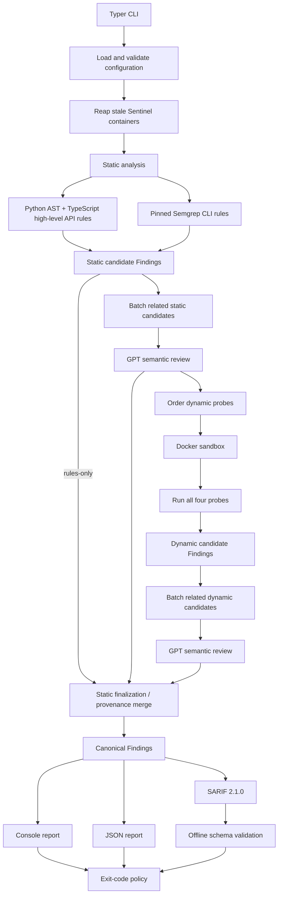
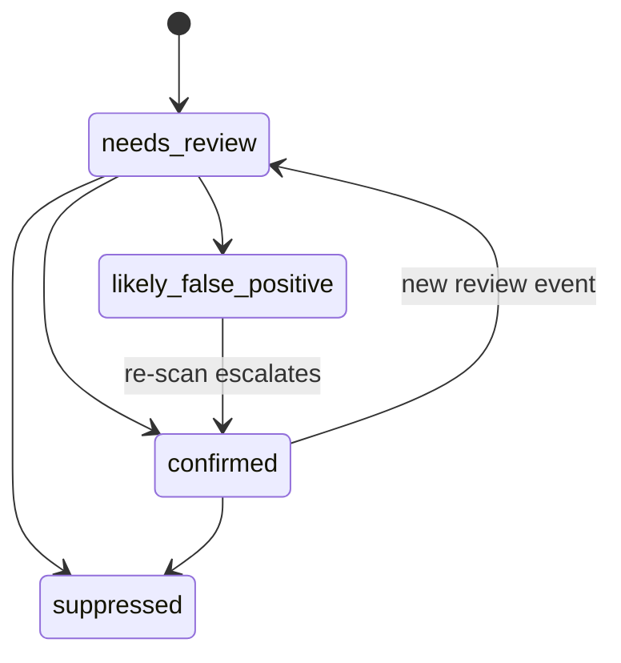
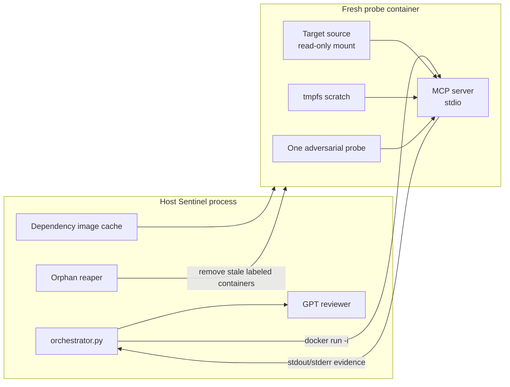

# PortunusMCP Sentinel Architecture

## 1. Purpose and status

This document is the approved architecture baseline for PortunusMCP Sentinel. It is concrete enough to guide implementation across sessions, but paths marked **planned** do not exist until their roadmap phase is complete.

PortunusMCP Sentinel is the build-time security plane of the PortunusMCP family. It scans an MCP server before deployment, combines deterministic static analysis with sandboxed dynamic probes, requires GPT semantic review in the normal pipeline, and emits one auditable Finding shape to console, JSON, and SARIF 2.1.0 outputs.

The [PortunusMCP Gateway](https://github.com/BashaarJavaid/PortunusMCP) and PortunusMCP Identity remain separate projects and are outside this architecture.

## 2. v1 scope

Phase 22's user-approved expansion contract is specified in
[`docs/phase22-technical.md`](docs/phase22-technical.md), including new rule
meanings, workspace compatibility, bounded campaigns and schema 1.7.0 migration.
Those changes remain pending until implemented and verified; the current scope
and native 1.6.0 contracts below continue to describe shipped behavior.

### Supported

- Local repository paths only.
- Sentinel CLI hosts using Python 3.10, 3.11, 3.12, or 3.13.
- Python MCP servers using Python 3.10, 3.11, or 3.12.
- The official Python MCP SDK and FastMCP.
- Static-only TypeScript MCP servers using official `@modelcontextprotocol/sdk`
  v1 or `@modelcontextprotocol/server` v2 high-level APIs.
- MCP over stdio.
- Static analysis using Python AST, bounded TypeScript source recognition, and
  a pinned Semgrep CLI.
- Dynamic analysis inside Docker.
- Required semantic review of deterministic candidates through the Responses API,
  using GPT-5.6 Sol by default or a validated compatible endpoint.
- Console, JSON, and SARIF 2.1.0 reporting.
- A composite GitHub Action on `ubuntu-latest`.

Python 3.12 is the primary development and artifact-build version. Python 3.10
is the compatibility floor, and the Sentinel host package is tested through
Python 3.13. If the target does not specify a compatible version through
`pyproject.toml`, `.python-version`, or its Sentinel target configuration, the
sandbox defaults to Python 3.11.

### Deferred or unsupported

- Remote repository cloning and scanning.
- Externally hosted or user-supplied running endpoints.
- Streamable HTTP transport in v1.
- Legacy SSE transport.
- Custom or hand-rolled MCP implementations beyond best-effort static parsing.
- Static analysis for languages beyond Python and TypeScript.
- JavaScript/TSX, workspaces, imported handlers or schemas, cross-file dataflow,
  low-level SDK handlers, TypeScript type checking, and Node dynamic probing.
- Free-standing GPT-originated findings.
- General exploit confirmation against arbitrary user targets.
- Automated patch generation and automated pull requests.

Unsupported target types, frameworks, transports, and configuration values fail explicitly with exit code `2`.

## 3. Architectural invariants

1. Static analysis never imports or executes target code.
2. Dynamic analysis is enabled by default and runs only inside Docker; explicit rules-only scanning bypasses GPT, cache, network, Docker, runtime configuration, and target execution.
3. Target source is mounted read-only and the host filesystem is otherwise unavailable to target code.
4. Runtime containers have no credentials and no external network or DNS access.
5. GPT review runs in the host-side Sentinel process. `OPENAI_API_KEY` is never forwarded to target installation or runtime containers.
6. GPT can annotate or reclassify a deterministic candidate, but it cannot create or silently delete a finding in v1.
7. Every finding remains traceable to a stable deterministic rule ID.
8. One canonical Finding model is shared by static analysis, dynamic analysis, GPT review, console output, JSON output, and SARIF output.
9. Severity is reproducible from `impact` and `exploitability`; GPT severity suggestions are advisory only.
10. A failed engine, review, sandbox, or SARIF validation is never reported as a clean scan.
11. Rules and probes do not require live access to third-party services. The SARIF schema and GPT test responses are stored locally.
12. Symlinks are not followed, and the scan root is a hard filesystem boundary.
13. GPT output uses strict Structured Outputs derived from the Pydantic review schema; free-form JSON is not accepted.
14. Review requests use `store: false`, transmit the minimum redacted context,
    and record requested/returned models, endpoint mode/hash, and usage metadata.

## 4. End-to-end scan pipeline


```mermaid
flowchart TD
    CLI[Typer CLI] --> CFG[Load and validate configuration]
    CFG --> REAP[Reap stale Sentinel containers]
    REAP --> STATIC[Static analysis]
    STATIC --> AST[Python AST + TypeScript high-level API rules]
    STATIC --> SEMGREP[Pinned Semgrep CLI rules]
    AST --> SF[Static candidate Findings]
    SEMGREP --> SF
    SF -->|rules-only| MERGE[Static finalization / provenance merge]
    SF --> BATCH1[Batch related static candidates]
    BATCH1 --> GPT1[GPT semantic review]
    GPT1 --> PRIORITY[Order dynamic probes]
    PRIORITY --> DOCKER[Docker sandbox]
    DOCKER --> PROBES[Run all four probes]
    PROBES --> DF[Dynamic candidate Findings]
    DF --> BATCH2[Batch related dynamic candidates]
    BATCH2 --> GPT2[GPT semantic review]
    GPT1 --> MERGE
    GPT2 --> MERGE
    MERGE --> REPORT[Canonical Findings]
    REPORT --> CONSOLE[Console report]
    REPORT --> JSON[JSON report]
    REPORT --> SARIF[SARIF 2.1.0]
    SARIF --> VALIDATE[Offline schema validation]
    CONSOLE --> EXIT[Exit-code policy]
    JSON --> EXIT
    VALIDATE --> EXIT
```

The normal order is:

1. Load configuration and validate the target.
2. Remove stale Sentinel-labeled containers.
3. Run both static engines.
4. Batch related static candidates by tool or file and review them with GPT.
5. Use the validated GPT probe plan only to reorder and safely parameterize, never skip, the dynamic probes.
6. Run all four dynamic probes in fresh ephemeral containers.
7. Batch related dynamic candidates and review them with GPT.
8. Deduplicate root causes and merge provenance.
9. Render reports, validate SARIF, and apply the exit-code policy.

`--static-only` skips target launch configuration, orphan reaping, Docker, and probes. It does not skip GPT review of static candidates. `--allow-degraded` permits unreviewed static or dynamic results when GPT is unavailable; without it, GPT failure is fatal.

### Explicit rules-only selection (Phase 18)

`--rules-only/--no-rules-only`, `SENTINEL_RULES_ONLY`, and
`[scanner].rules_only` resolve using the existing precedence; default false.
Resolve selection before validating inactive LLM values, endpoint routing, trust
acknowledgments, or loading runtime configuration. Rules-only implies static;
legacy static/degraded/launch options have no additional effect. Scanner and
syntax validation, filesystem boundaries, and target support remain required.

The existing pipeline branches after deterministic analysis and before reviewer
construction. Orphan reaping is bypassed. No review cache, model client, network,
Docker, or target execution occurs. Findings, evidence, severities, inline
suppression, baselines, and thresholds remain in the shared static finalizer.
`sentinel demo` explicitly disables inherited rules-only selection.

Native 1.5.0 keeps the canonical Finding shape and admits null finding reviews
for this tier; older `not_reviewed` objects remain valid. GPT summaries and
provenance reviews are null. Consumers and validators must support this nullable
field. GPT-static, dynamic, and GPT-dynamic stages are skipped with reason
`rules-only scan requested`. Static, merge/finalization, and reporting succeed;
completion describes the selected tier. SARIF invocation properties export the
existing stage records; Action readers still accept older SARIF without stages.

Default `init` writes only the permissions sidecar, without launch inference or
runtime prerequisites. Python-only `init --dynamic` adds launch scaffolding,
preserving and validating existing permissions when adding missing runtime
configuration. Replacement requires `--force`; regular-file checks, symlink
rejection, atomic staging, and rollback remain enforced.

The Action defaults are preserved. Rules-only input inherits when empty and
explicitly overrides when true/false. Fork credentials remain withheld and fork
uploads skipped. Ordinary SARIF upload, dependency installation, and dependency
auditing need network access separately. The existing pre-commit hook now runs
`sentinel scan . --rules-only --no-color`.

## 5. Planned repository layout

The build brief's repository tree is the approved baseline, extended only by paths required by the accepted contracts.

```text
.
├── action.yml
├── LICENSE
├── Makefile
├── pyproject.toml
├── README.md
├── AGENTS.md
├── ARCHITECTURE.md
├── ROADMAP.md
├── sentinel.toml
├── schemas/
│   ├── finding.schema.json
│   ├── report.schema.json
│   └── sarif-2.1.0.schema.json
├── artifacts/
│   ├── example.sarif
│   └── gpt-ablation.json
├── scripts/
│   └── reap_orphans.py
├── src/
│   └── sentinel/
│       ├── cli.py
│       ├── config.py
│       ├── finding.py
│       ├── schema.py
│       ├── orchestrator.py
│       ├── owasp_mapping.py
│       ├── static/
│       │   ├── engine.py
│       │   ├── semgrep_adapter.py
│       │   └── rules/
│       ├── dynamic/
│       │   ├── prober.py
│       │   └── sandbox.py
│       ├── llm/
│       │   ├── schema.py
│       │   ├── semantic_reviewer.py
│       │   └── exploit_confirm.py
│       └── report/
│           ├── console.py
│           ├── sarif.py
│           └── validate_sarif.py
├── tests/
│   ├── fixtures/
│   │   ├── vulnerable_server/
│   │   └── clean_server/
│   ├── evals/
│   │   └── gpt_review_cases.yaml
│   └── test_rules/
└── demo/
    └── vulnerable_server/
```

Key ownership boundaries:

- `cli.py` is a thin Typer argument-parsing shell.
- `orchestrator.py` owns phase ordering and failure propagation.
- `config.py` loads, merges, and validates CLI, environment, scanner, and target configuration.
- `finding.py` owns the canonical Pydantic Finding model and severity calculation.
- `schemas/finding.schema.json` is generated from `finding.py` with `model_json_schema()` and checked in for external consumers. It is not hand-maintained.
- `schemas/report.schema.json` is generated from the native report model and references `finding.schema.json` through an offline relative `$ref`.
- `schema.py` owns deterministic `python -m sentinel.schema generate|check` commands. Hatchling force-includes the root schemas as installed package resources without a second checked-in copy.
- `static/` never imports from `dynamic/`, and `dynamic/` never imports from `static/`.
- Both producers depend on `finding.py`; report modules consume the same model.
- `llm/schema.py` defines the validated semantic-review response.
- `tests/evals/gpt_review_cases.yaml` is the versioned truth set for measuring rules-only, GPT-reviewed, and dynamically confirmed behavior.
- `artifacts/gpt-ablation.json` is a generated evaluation artifact, not hand-authored evidence.
- `report/validate_sarif.py` owns offline SARIF validation.
- `llm/exploit_confirm.py` is Phase 6 stretch work and is not part of the required pipeline.

## 6. Canonical Finding model

The planned Pydantic model at `src/sentinel/finding.py` is authoritative. Its generated external schema is `schemas/finding.schema.json`.

### Required fields

| Field | Contract |
|---|---|
| `finding_id` | UUID unique to one finding instance in one scan run. |
| `dedup_key` | Stable content hash for matching the same root cause across scans. |
| `rule_id` | Stable rule identifier such as `SENT-003`. |
| `title` | Short human-readable finding title. |
| `description` | Explanation of the detected security issue. |
| `impact` | `Critical`, `High`, `Medium`, `Low`, or `Informational`. |
| `exploitability` | `confirmed`, `likely`, or `theoretical`. |
| `severity` | Calculated from impact and exploitability. |
| `confidence` | Normalized `high`, `medium`, or `low`. |
| `status` | `needs_review`, `confirmed`, `likely_false_positive`, or `suppressed`. |
| `owasp_category` | Pinned `ASI0X:2026` identifier and canonical category name. |
| `source` | Origin only: `static` or `dynamic`. GPT never overwrites it. |
| `location` | File plus line/column range, or a tool/schema path. |
| `evidence` | Structured evidence appropriate to the originating detector. |
| `remediation` | Actionable mitigation guidance. |
| `scan_id` | Identifier shared by all findings from one scan. |
| `timestamp` | Finding creation timestamp. |
| `provenance` | Array of `{source, rule_id, evidence, timestamp, review}` entries; review is nullable. |
| `review` | Nested GPT audit record containing mode, returned model, raw confidence, reasoning, grounded evidence references, probe plan, advisory severity, usage, latency, and review time. |

Static evidence contains a code snippet and line range. Dynamic evidence contains probe IDs, redacted request/response payloads, and logs. Secret values are redacted before evidence is stored.

### Identity and deduplication

- `finding_id` is a per-scan UUID and is never used for cross-scan matching.
- A static `dedup_key` hashes `(rule_id, file_path, normalized_location)`.
- A dynamic `dedup_key` also includes `probe_id`.
- Repeated deduplication keys update the existing finding's status and timestamp rather than creating duplicate rows.
- When `SENT-009` or `SENT-011` confirms an existing `SENT-003` root cause, the merged finding keeps `rule_id=SENT-003` and `source=static`; the dynamic result is appended to `provenance` and evidence.
- Without an existing `SENT-003`, `SENT-009` and `SENT-011` remain separate findings.
- `SENT-008` and `SENT-010` always remain distinct root causes.

### Status lifecycle

Static candidates and historical unverified observations follow the review
lifecycle below. Newly verified runtime violations start `confirmed` with high
confidence; GPT review cannot downgrade or suppress that proof.


```mermaid
stateDiagram-v2
    [*] --> needs_review
    needs_review --> confirmed
    needs_review --> likely_false_positive
    needs_review --> suppressed
    confirmed --> suppressed
    confirmed --> needs_review: new review event
    likely_false_positive --> confirmed: re-scan escalates
```

Suppression always records reasoning. A finding cannot transition directly from `confirmed` to `likely_false_positive`; it must return to `needs_review` through a review event first.

The semantic reviewer emits only `confirmed`, `suppressed`, or `needs_review`. `likely_false_positive` is reserved for the Phase 6 exploit-confirmation layer.

### Severity calculation

Rule metadata supplies impact. Exploitability adjusts the emitted severity:

| Exploitability | Severity calculation |
|---|---|
| `confirmed` | Severity equals impact. |
| `likely` | Severity equals impact. |
| `theoretical` | Severity is one level below impact. |

The downward mapping is `Critical → High → Medium → Low → Informational`, with `Informational` as the floor. Missing exploitability is treated as `theoretical`.

Exploitability is assigned as follows:

- A dynamic proof or observed canary side effect is `confirmed`.
- A static match corroborated by GPT with review status `confirmed` is `likely`.
- A static match that is unreviewed, degraded, suppressed, or still `needs_review` is `theoretical`.

GPT's `suggested_severity_override` is persisted in `review` but never changes severity automatically.

## 7. OWASP mapping

Every rule is pinned to the OWASP Top 10 for Agentic Applications 2026 taxonomy. Existing rule mappings do not silently change when OWASP publishes a later edition.

| ID | Category |
|---|---|
| `ASI01:2026` | Agent Goal Hijack |
| `ASI02:2026` | Tool Misuse & Exploitation |
| `ASI03:2026` | Identity & Privilege Abuse |
| `ASI04:2026` | Agentic Supply Chain Vulnerabilities |
| `ASI05:2026` | Unexpected Code Execution |
| `ASI06:2026` | Memory & Context Poisoning |
| `ASI07:2026` | Insecure Inter-Agent Communication |
| `ASI08:2026` | Cascading Failures |
| `ASI09:2026` | Human-Agent Trust Exploitation |
| `ASI10:2026` | Rogue Agents |

`src/sentinel/owasp_mapping.py` is the canonical rule-to-category mapping in source.

## 8. Static analysis

### Hybrid engine

`src/sentinel/static/engine.py` coordinates two deterministic engines:

- Custom AST rules own MCP-specific semantics: declared scopes versus handler behavior, schemas, prompt flow, auth dependencies, and manifest integrity.
- `src/sentinel/static/semgrep_adapter.py` invokes the pinned Semgrep CLI as a subprocess for generic code patterns such as unsafe execution/deserialization and hardcoded secrets.

TypeScript roots require a strict, bounded root `package.json`, a production
dependency on an official MCP package, and an included `.ts`, `.mts`, or `.cts`
source. They always pass through Semgrep's syntax gate, never load Node modules,
and are rejected before analysis unless `--static-only` or `--rules-only` is selected. The
orchestrator owns one dedicated Semgrep catalog-discovery pass and reuses that
catalog for GPT review.

Semgrep is a required `[project.dependencies]` dependency, not a development-only or optional extra. Sentinel checks the installed Semgrep version at startup. Static analysis never imports target modules.

### Phase 16 flow and safety recognition

Phase 22's execution correction indexes SENT-004 prompt sinks before branch
analysis and reuses each event's sink list across paths. Functions without a
supported sink cannot produce this rule's finding; source and coverage inventory
are retained. The 120-second scan deadline and detector selection are unchanged.

Static traversal recognizes YAML with template delimiters below a chart's
`templates/` directory when a non-symlink `Chart.yaml` exists inside the scan
root. Original bytes still reach text/secret checks. Each such file emits
`static_helm_template_unparsed`, disclosing omitted structured YAML analysis.
Ordinary YAML, chart values and `sentinel.*` configuration remain strictly parsed.
Sentinel never renders charts or runs target tooling.

`SENT-002` combines the installed engine with bounded Python AST and TypeScript
source analysis. It traces tool inputs through top-level same-file named
helpers, assignments, explicit argument bindings, and returned values. Python
keyword arguments and simple TypeScript object-field destructuring are supported.
Constant arguments or helper returns do not establish input-derived execution.
There is no fixed helper-hop limit; the existing 120-second scan deadline bounds
the analysis. Expiry is an infrastructure failure, not a completed clean scan.

Imported helpers, recursion, ambiguous bindings, spreads, dynamic aliases,
methods, nested functions, and unsupported control/mutation paths produce
`static_flow_unresolved` where encountered by this analysis. An unknown call
alone does not establish an execution sink. A helper finding points at the
tool's call site and describes its known sink locations; direct finding
locations and identity construction are preserved. Inline suppression binds to
the primary call site. Existing GPT context windows remain unchanged; a flow
outside those windows adds `static_review_context_incomplete`.

Safety exemptions follow the relevant value across simple assignments and
ordinary `if`/`else` paths, including rejecting exits:

- `SENT-003` recognizes consumed Pydantic/Zod parsed results, enforced
  non-transforming JSON Schema/Ajv checks, primitive framework schemas, and
  supported custom type/allowlist guards. Unrelated checks, ignored parse
  results, unprotected fields, use before validation, and replacement after
  validation do not establish protection.
- `SENT-004` treats configured sanitizers as explicit user trust. Only the
  sanitizer result loses taint; discarded results, overwrites, and raw-content
  reintroduction remain candidates. This does not establish that a sanitizer
  prevents prompt injection.
- `SENT-006` requires recognized imports and applicable FastAPI dependencies,
  Starlette authentication plus authenticated permissions, Express middleware,
  or Hono bearer authentication. Recognized credential checks must compare
  request-derived data to literal/environment anchors and reject failures
  before route continuation. Installation alone, wrong applications or paths,
  bypasses, no-op callbacks, and request-derived anchors do not exempt a route.
- `SENT-007` requires enforced SHA-256 comparison or native signature
  verification over the consumed manifest bytes. Supported signatures are
  Ed25519, RSA-PSS-SHA256, and ECDSA-SHA256 through Python `cryptography` or
  Node crypto. Trust comes from a literal pin/key or a validated
  `sentinel.integrity.yaml` reference bound to the manifest. Native Python
  verification rejects by raising; Node's boolean result must be enforced.
  Hashing alone, unrelated bytes, self-comparison, ignored results, and
  replacement after verification do not establish integrity.

These recognizers do not interpret arbitrary language or framework behavior.
Unrecognized protection can retain a candidate for review, and unresolved flows
are not proof of safety. The canonical Finding and report schemas, rule IDs,
CLI behavior, and candidate-bound review contract are unchanged.

The historical Phase 2 evaluation uses the frozen canonical Findings in
`tests/evals/phase16-prechange-findings.json`, with unchanged source and captures.
The current detector emits three candidates for that source because it now
recognizes the enforced custom validator; the historical comparison retains
its original four inputs. Historical replay is not a current-detector accuracy
measurement. Reproductions and compatibility evidence are recorded in
[`docs/phase16-verification.md`](docs/phase16-verification.md).

### Initial permanent rule catalog

| ID | Detection boundary | OWASP | Impact | False-positive risk | Fixture acceptance |
|---|---|---|---|---|---|
| `SENT-001` | Filesystem or network scope is broader than the handler actually uses. | `ASI03:2026` | High | Medium: some tools are legitimately broad. | Vulnerable fixture has a broad grant with narrow use. Clean fixture has matched scope and a justified legitimately broad tool. |
| `SENT-002` | `eval`, `exec`, `pickle.loads`, unsafe `yaml.load`, or a subprocess command is built from raw tool arguments. | `ASI05:2026` | Critical | Low. | Vulnerable fixture passes a raw argument to `eval`. Clean fixture uses `ast.literal_eval` or a fixed allowlist. |
| `SENT-003` | No schema or model validates a tool handler's parameters before use. | `ASI02:2026` | Medium | Medium. | Vulnerable fixture reads unchecked keyword arguments. Clean fixture validates with Pydantic or JSON Schema first. |
| `SENT-004` | Tool output or description is re-interpolated into a later prompt without sanitization. | `ASI01:2026` | High | Medium–High; this heuristic is documented as best effort. | Vulnerable fixture interpolates directly. Clean fixture passes content through a defined sanitizer. |
| `SENT-005` | Regex or entropy-based secret scanning matches source or configuration. | `ASI03:2026` | Critical | Low–Medium because entropy checks can match benign values. | Vulnerable fixture contains a hardcoded key. Clean fixture reads from `os.environ`. |
| `SENT-006` | An HTTP route has no auth middleware, or its auth check is a no-op. | `ASI03:2026` | High | Low. | Vulnerable fixture lacks an auth dependency. Clean fixture verifies bearer or session authentication. |
| `SENT-007` | A tool manifest loader accepts a manifest without signature verification or hash pinning. | `ASI04:2026` | Medium | Low. | Vulnerable fixture has no integrity check. Clean fixture verifies a signature or pinned hash. |

Rule IDs become permanent when committed and are never renumbered or reassigned.

### Rule acceptance gate

Each rule must have:

1. A vulnerable fixture that triggers it.
2. A clean fixture that does not trigger it, including relevant false-positive controls.
3. An explicit `ASI0X:2026` category justification.
4. A written false-positive risk statement.
5. An impact rating evaluated through the fixed severity rubric.
6. Proof that the detector executes no target code.
7. A completed rule-review checklist before merge.

For `SENT-005`, `[rules.SENT-005]` in `sentinel.toml` can allowlist file-path globs and SHA-256 fingerprints of matched secret values. Plaintext secrets and free-form regex allowlisting of secret values are prohibited.

## 9. GPT semantic review

### Role and authority

GPT-5.6 review is required in the normal pipeline and processes both static and dynamic candidates. It may:

- Set an allowed review status.
- Reassess confidence.
- Record reasoning.
- Cite the exact supplied code/schema evidence supporting its judgment.
- Produce a constrained plan that orders and parameterizes the four approved dynamic probe templates.
- Suggest a severity override for human or later automated review.

It may not create a finding without a deterministic rule, change the finding's origin, silently delete a finding, automatically change severity, skip a required probe, invent a probe ID, emit executable probe code, or reference evidence outside the supplied context.

### API and model contract

The reviewer uses the Responses API with configurable model, reasoning effort,
and base URL. Public OpenAI permits exactly `gpt-5.6-sol` and its documented
`gpt-5.6` alias. A compatible endpoint accepts a 1–128-character deployment ID
that begins with an ASCII letter or digit and otherwise contains only letters,
digits, `.`, `_`, `:`, `/`, or `-`. Sentinel accepts `low` and `medium` effort
for both endpoint modes. The requested model and actual returned
`response.model` are recorded separately; a validated mismatch is accepted and
preserved without warning.

- Default reasoning effort: `medium`.
- Evaluation comparison: `medium` versus `low` on the versioned review cases.
- Pro mode is not part of the required pipeline unless a later measured evaluation justifies it.
- Requests set `store: false` because scanned source may be proprietary.
- Requests set `service_tier=default`, `verbosity=low`, disable streaming and
  background execution, provide no tools, and use
  `min(16384, 1024 + 1024 * finding_count)` output tokens.
- The integration uses strict Structured Outputs generated from the Pydantic models in `src/sentinel/llm/schema.py`.
- Refusals, incomplete responses, schema violations, and unsupported response item types follow the documented retry and failure policy; they are never coerced into a valid review.
- Programmatic Tool Calling and multi-agent mode are not dependencies of the required pipeline. They may be evaluated later without changing the baseline review contract.

### Request boundary

The host-side reviewer authenticates only with `OPENAI_API_KEY`. Public OpenAI
retains `OPENAI_ORG_ID` and `OPENAI_PROJECT_ID`; compatible requests suppress
both headers. Each request contains only:

- Finding and rule IDs.
- Tool schema and description.
- Flagged source snippet with a small surrounding window.
- Repository-relative locations.
- The fixed rule definition, OWASP mapping, impact, and allowed status transitions.
- The four approved probe IDs and their non-executable template contracts when a static review can influence probe order.

Anything matched as a secret by `SENT-005` and all absolute paths are redacted before transmission.

The primary enclosing unit is at most 80 contiguous lines. Up to two directly
called same-file helpers contribute at most 40 lines each, with a hard total of
160 lines per candidate. Typed placeholders preserve line structure. The same
sanitizer runs over model reasoning and evidence claims before persistence;
unsafe redaction fails the review stage.

Related candidates are grouped by tool or file so GPT can reason about one local security boundary in one call. Batches contain at most ten findings. Whole validated batches are cached; any member, context, tool metadata, model, prompt/schema version, or effort change invalidates the group. Compatible cache identity also includes the normalized endpoint URL hash, so endpoints cannot share reviews. Existing public cache/replay data without endpoint fields is inferred as public OpenAI when applied.

### Validated response

`src/sentinel/llm/schema.py` supplies the strict Structured Outputs schema and validates the parsed response. A representative response is:

```json
{
  "reviews": [
    {
      "finding_id": "4d9be89f-73a8-4f9f-b46d-d8b63850be8a",
      "status": "confirmed",
      "confidence": 0.91,
      "reasoning": "The handler consumes limit before any schema validation.",
      "evidence_refs": [
        {
          "path": "server.py",
          "start_line": 42,
          "end_line": 48,
          "claim": "Unvalidated tool input reaches the handler logic."
        }
      ],
      "probe_plan": {
        "ordered_probe_ids": ["SENT-011", "SENT-009", "SENT-010", "SENT-008"],
        "target_tool": "search_records",
        "argument_bindings": [
          {"probe_id": "SENT-009", "field": "limit", "value": "__SENTINEL_OVERSIZED__"},
          {"probe_id": "SENT-010", "field": "query", "value": "__SENTINEL_INJECTION__"},
          {"probe_id": "SENT-011", "field": "limit", "value": "__SENTINEL_WRONG_TYPE__"}
        ]
      },
      "suggested_severity_override": null
    }
  ]
}
```

The review status enum remains exactly `confirmed | suppressed | needs_review`.
Suppressed static findings may set `probe_plan` to `null`, in which case the
dynamic stage uses its fixed safe fallback. Dynamic-candidate reviews also set
`probe_plan` to `null` because the probes have already run.

Host-side validation additionally enforces:

- Every requested `finding_id` appears exactly once and no unknown ID appears.
- Every evidence path and line range exists inside the redacted context supplied for that finding.
- `ordered_probe_ids` contains each of `SENT-008` through `SENT-011` exactly once.
- `target_tool` is a tool discovered in the target's supplied schema.
- Argument bindings are limited to fields declared by the target tool and inert values accepted by the approved probe template.
- The model cannot provide shell, Python, SQL, or other executable probe programs.

After validation, `semantic_reviewer.py` adds the requested model, returned `response.model`, endpoint mode, SHA-256 URL hash, review mode (`live`, `replay`, `cached`, or `degraded`), `batch_id`, original `reviewed_at`, and current `applied_at`. Cached reviews preserve their original model, usage, latency, and batch provenance. Degraded review objects have no endpoint fields and `reviewed_at=null`. The raw numeric confidence remains in the nested review record. Top-level confidence is updated to:

- `high` for values at or above `0.8`.
- `medium` for values from `0.5` through `0.79`.
- `low` for values below `0.5`.

Before review, deterministic candidates default to top-level confidence `high`.

### Grounded probe planning

Probe planning makes GPT operationally consequential without granting it arbitrary execution authority:

1. Static rules produce deterministic candidates.
2. GPT grounds its judgment in supplied evidence references.
3. GPT orders all four fixed probe IDs and binds safe template fields to the relevant target tool schema.
4. Sentinel validates the plan independently.
5. The Docker prober executes every required template under the existing sandbox limits.
6. Dynamic evidence is merged back into the deterministic finding.

An invalid plan does not remove or skip probes. Sentinel falls back to the fixed default order, records the plan validation failure, and preserves the original candidate for review.

Eligibility and field bindings share declared-type classification for primitive
`type`, type arrays, and the source extractor's nested `anyOf` unions. A nullable
string can receive an injection or oversized probe; nullable arrays and objects
can receive oversized probes. Numeric-only and untyped fields do not qualify.
This classification does not resolve references or establish runtime schema
support; the Docker prober retains its independent schema and baseline checks.
The [nullable-field correction](docs/nullable-probe-validation.md) is separate
from the frozen Phase 20 baseline.

### Operational limits

- 30-second request timeout.
- Two retries with backoff.
- At most five concurrent requests.
- Default `max_findings_per_scan = 500`, configurable through `sentinel.toml`.
- The cap limits findings, not API calls; related cache misses are batched by tool or file.
- Whole-group identity includes each rule ID, full transmitted-context hash,
  merged tool-metadata hash, model, prompt/review-schema versions, effort, and
  complete group composition.
- Candidates beyond the cap remain `needs_review`; they are never dropped. The console and report summary warn that review was truncated.
- Reaching the configured cap is expected volume control, not an internal failure, and does not produce exit code `3`.
- Stable prompt and rule prefixes are kept separate from dynamic request data so prompt caching remains measurable. Explicit cache breakpoints are adopted only after the evaluation shows a benefit.
- Recorded real-response fixtures are replayed in CI; CI does not make live GPT calls.
- Public pricing for both approved model IDs is canonicalized to
  `gpt-5.6-sol`: $4/M input, $0.40/M cached input, $20/M output, and 1.25×
  cache-write input as of 2026-09-04. Compatible endpoints retain usage but
  set pricing and micro-USD costs to `null`.

Each live batch records:

- Requested and returned model identifiers.
- Reasoning effort and review mode.
- Finding and batch counts.
- Input, output, reasoning, cached, and cache-write tokens when returned by the API.
- End-to-end latency, retries, refusal/incomplete state, and schema-validation outcome.
- Cache hits and misses.
- Counts of confirmed, suppressed, and needs-review model judgments, separately
  from top-level finding statuses and explicit runtime-proof disagreements.

Aggregate telemetry appears in console/JSON summaries and SARIF invocation properties. It contains no source snippets, secrets, or absolute paths.

GPT unavailability is exit code `3` by default. With `--allow-degraded`, static
candidates stay `needs_review`; verified runtime proof stays confirmed/high.
The nested review records the unavailable model:

```json
{
  "reviewed": false,
  "reason": "GPT unavailable — degraded mode"
}
```

Forked GitHub pull requests automatically use degraded mode when secrets are unavailable and clearly annotate the skipped review.

### Evaluation and ablation

`tests/evals/gpt_review_cases.yaml` contains representative true positives, seeded false positives, ambiguous cases, and probe-prioritization cases. The same versioned cases run through three treatments:

1. Deterministic rules only.
2. Deterministic rules plus GPT review.
3. Deterministic rules plus GPT review plus dynamic proof.

The generated `artifacts/gpt-ablation.json` reports true positives, false positives, precision, recall where the fixture truth set permits it, status transitions, structured-output validity, evidence-reference validity, probe-plan validity, latency, tokens, cache behavior, and cost per successfully reviewed finding. Cost estimates record the requested and returned model, pricing source, and pricing-as-of date; if authoritative pricing is unavailable, the artifact reports token usage without inventing a monetary estimate. The ablation also compares `medium` and `low` reasoning effort without changing the production default until results justify it.

The evaluation must demonstrate at least one corroborated true positive, one grounded suppression that remains visible, one ambiguous `needs_review` outcome, and one correctly prioritized dynamic probe. This is the evidence that GPT-5.6 improves the scanner rather than merely rewriting deterministic output.

### Recorded replay mode

The normal scan and default `sentinel demo` path use live GPT review. `sentinel demo --replay-review` is a separate, visibly labeled offline path that replays the checked-in response cassettes through the same parser, validation, merge, and reporting code.

Replay results set `review.mode = "replay"`, display a prominent console/SARIF annotation, and can never be represented as a live model call. Replay mode exists for reproducible testing without an API key; historical live evidence remains in `artifacts/`.

## 10. Dynamic analysis and Docker isolation

### Isolation boundary


```mermaid
flowchart LR
    subgraph Host[Host Sentinel process]
        ORCH[orchestrator.py]
        GPT[GPT reviewer]
        CACHE[Dependency image cache]
        REAPER[Orphan reaper]
    end

    subgraph Docker[Fresh probe container]
        SRC[Target source\nread-only mount]
        TMP[tmpfs scratch]
        SERVER[MCP server\nstdio]
        PROBE[One adversarial probe]
    end

    ORCH -->|docker run -i| SERVER
    CACHE --> Docker
    SRC --> SERVER
    TMP --> SERVER
    PROBE --> SERVER
    SERVER -->|stdout/stderr evidence| ORCH
    ORCH --> GPT
    REAPER -->|remove stale labeled containers| Docker
```

### Target contract

Dynamic scans require either a valid `sentinel.target.yaml` or a `--target-launch-cmd` override. An ordinary scan without target launch configuration exits with code `2`. `--static-only` and `--rules-only` skip runtime configuration.

`sentinel.target.yaml` owns target execution settings:

- `language`
- `launch_cmd`
- optional `install_cmd`
- `transport`
- `working_dir`
- `env` for literal non-secret values
- `env_from` for explicitly named host variables
- optional `python_version`
- optional `probe_baselines` containing complete argument examples by tool name

Only `transport: stdio` is accepted in v1. `http`, `port`, SSE, and other transport values are rejected during configuration loading.

`env_from` rejects names matching secret-oriented deny patterns such as `SECRET`, `KEY`, `TOKEN`, `PASSWORD`, or `CREDENTIAL`. No credentials are allowed in dependency-install or probe containers. `OPENAI_API_KEY` is always host-side and is explicitly excluded from `env_from`.

### Dependency image

- The cached image contains dependencies only; target source is never baked into it.
- `install_cmd` may install dependencies but may not install the target package itself.
- Phase 3 accepts dependency-only pip requirements forms for `install_cmd`.
  Poetry and uv install commands are rejected during configuration loading.
- When `install_cmd` is absent, Sentinel infers dependencies from one unambiguous
  source: `requirements.txt` or PEP 621 `project.dependencies` in `pyproject.toml`.
- Package build scripts may run only inside the build container.
- Build-time network is restricted to registries listed in `[sandbox].allowed_registries`.
- The default registry allowlist is `pypi.org` and `files.pythonhosted.org`.
- Credentials are never passed to the build.
- Base images are pinned official Python bookworm images containing Git for
  Git-backed MCP servers. These larger images retain the same build-network
  and runtime isolation boundaries.
- The cache key hashes Python version, base-image digest, install command,
  Sentinel version, and dependency-lockfile hash.

### Probe runtime

Each probe gets separate fresh baseline and attack containers from the dependency
image so state cannot persist between sessions.

- Target source: read-only mount.
- Scratch space: ephemeral tmpfs.
- Host filesystem: inaccessible outside the target mount.
- Communication: `docker run -i` over stdin/stdout only.
- Network: external egress and DNS denied.
- Environment: host environment stripped; only validated `env` and `env_from` values passed.
- Privilege: `--security-opt=no-new-privileges`.
- Processes: `--pids-limit=64` and one process tree.
- CPU: 1 CPU.
- Memory: 512 MB.
- Per-session protocol deadline: 10 seconds, including initialization and discovery.
- Full dynamic-pass timeout: 120 seconds.
- Cleanup: inspect before teardown for proof, inspect stopped state for diagnostics,
  then `try/finally` force removal. Probe containers do not use `--rm`.

`scripts/reap_orphans.py` runs at the beginning of every dynamic invocation and force-removes Sentinel-labeled scan containers older than 120 seconds. Docker unavailability, startup failure, probe infrastructure failure, or cleanup failure is exit code `3`; Sentinel never silently falls back to static-only.

### Required probes

| ID | Probe | Safe behavior | Finding behavior | OWASP | Impact |
|---|---|---|---|---|---|
| `SENT-008` | Call a tool not granted to the session. | Reject before execution. | The tool executes. | `ASI02:2026` | Critical |
| `SENT-009` | Send a bounded oversized argument after a valid baseline. | Reject a violated size limit, or process legitimate large input. | Accept an explicit size-limit breach or suffer an observed OOM/crash. Timeout alone is inconclusive. | `ASI05:2026` | Medium |
| `SENT-010` | Send shell, SQL, or template-injection strings. | Treat them as inert data. | Observe a canary side effect such as a Sentinel scratch file. | `ASI05:2026` | Critical |
| `SENT-011` | Omit a required field or send the wrong type. | Reject with a validation error. | Process without error. | `ASI02:2026` | Low |

The validated GPT probe plan may reorder and bind approved inert template values for these probes. Sentinel independently validates the target tool, field names, values, and probe set; all four probes run even when the plan is absent or invalid.

### Phase 17 accepted contract (complete)

Baseline execution, proof conditions, sandbox lifecycle, report 1.5.0, GPT proof
preservation, precise merging, and baseline/replay identity are implemented.
All four checkpoints are accepted. Final verification and the separately
budgeted live-review gate passed; Phase 17 is complete.
See [`docs/phase17-verification.md`](docs/phase17-verification.md).

#### Baseline and execution

`sentinel.target.yaml` gains optional `probe_baselines`, mapping each tool name
to a complete JSON argument object. A configured example takes precedence over
generation and is never merged with generated fields. Both paths validate
against the runtime tool schema using the installed JSON Schema validator,
honoring supported declared dialects and defaulting to 2020-12. References are
local only; validation must never retrieve schemas or execute target code.

Generation uses validated defaults, constants, enums, simple scalars, arrays,
and nested objects. Generation is bounded to depth 8, 16 array items, and 16 KiB
serialized arguments; configured examples share the depth and serialized-size
limits. Unsupported schemas get an explicit outcome. Missing prerequisites,
locally invalid examples, and unsuccessful runtime baselines cannot prove a
vulnerability.

Each fixed probe has one legitimate baseline and one adversarial call in
separate fresh containers, with 10 seconds per session and 120 seconds per
campaign. Baseline and attack timings are separate diagnostics. Oversized
payloads retain the 1 MiB cap. Validated-plan selection and deterministic
fallback ordering remain; this is still a four-probe campaign, not broader
per-tool coverage. A timeout alone is inconclusive. Independent probes continue
after unsupported or inconclusive attempts, retaining completed results.
Docker, startup, inspection, or cleanup failure stops the campaign and marks
remaining probes untested.

Probe containers omit `--rm` so stopped-container state can be inspected before
cleanup. Force-removal runs in `finally`, including interruption paths. Orphan
reaping and all existing network, filesystem, credential, CPU, memory, process,
and scratch-space restrictions remain required.

#### Decisive security conditions

| Probe | Evidence required for a violation |
|---|---|
| `SENT-008` | A successful granted-tool control, then successful processing of valid arguments by a listed ungranted tool. Unknown-name fallback rejection is a completed negative attempt; unknown-name success is inconclusive because real tool execution is unproven. Sidecars declare tool-name expectations; this does not test path/network containment. |
| `SENT-009` | Successful processing that violates explicit `maxLength`, `maxItems`, or `maxProperties`, or a successful baseline followed by an attributable Docker-observed OOM/crash. Retain limits, measured sizes, and decisive process state. Startup failure, scanner termination, timeout alone, and legitimate large-input success are not proof. |
| `SENT-010` | Canary absent before attack, absent after the separate baseline, and present after attack. Preserve the effect even when the MCP response reports an error. A pre-existing canary is inconclusive; failed inspection is infrastructure failure. |
| `SENT-011` | Preserve valid siblings, omit an actually required field or use a genuinely invalid type, and validate the complete mutation locally before sending. Record the violated constraint. Schema-valid objects and unconstrained nested fields do not establish malformed input. Successful processing of verified invalid arguments establishes the violation. |

Impacts remain Critical, Medium, Critical, and Low respectively. Stable rule IDs
and the severity rubric do not change. A completed applicable attempt without a
violation is `no_violation_observed`; it is not general evidence of safety.

#### Canonical outcomes and review

Native report schema **1.5.0** adds nullable `dynamic_analysis`. It is null for
skipped analysis and unavailable historical summaries. Otherwise record exactly
one outcome for each fixed probe, including binding (tool/field), reason,
bounded baseline/attack evidence, schema checks, and observed effects:

| `status` | Meaning | `verdict` |
|---|---|---|
| `tested` | Applicable attempt completed with the required control and observation. | `violation_observed` or `no_violation_observed` |
| `unsupported` | Schema or binding cannot support a sound attempt. | null |
| `untested` | Attempt did not run, including remaining work after infrastructure failure. | null |
| `inconclusive` | Prerequisite or observation cannot resolve the security condition. | null |

Any required unsupported, untested, or inconclusive outcome sets
`analysisComplete=false`. `executionSuccessful` describes infrastructure health.
Exit 3 takes precedence over finding thresholds, preserving partial findings.
Console and JSON show outcomes by default; SARIF stores scan-level outcomes in
invocation properties. Finding evidence remains in canonical Finding/provenance.

Newly verified runtime violations start `confirmed` with high confidence.
Nested GPT status, confidence, reasoning, and suggested suppression remain
separate judgments. Model absence, abstention, or disagreement cannot downgrade
or suppress host proof, including proof merged into static provenance. Normal
GPT completion requirements still apply. Summary model counts use model
judgments, independently of finding statuses; disagreements are explicit.

Merge `SENT-009`/`SENT-011` into `SENT-003` only when tool and parameter mapping
establish the same validation cause. Preserve static ID/source and append
runtime evidence. Uncertain mappings and resource-only failures stay separate.

#### Stable identity and historical compatibility

`sentinel-baseline-v2` identifies proof by probe/tool/field, schema or policy
identity, normalized request, and decisive result. Timing, container identifiers,
and incidental logs remain diagnostic and do not affect replay or baseline
identity. Supported 1.3/1.4 report migrations must not invent verified proof or
completed probe outcomes. Preserve static matching; historical entries cannot
suppress newly verified runtime proof, including proof merged into static
findings.

Retain original artifacts, source inputs, and captures with their original
semantics. Refresh only affected captures, following separate budget approval;
never relabel an old response as a review of changed evidence. Generated schemas,
compatibility guidance, user docs, and release notes change together in the
owning implementation checkpoint. Version 1.3.0 includes the accepted Phase
16–18 changes; publication follows separately authorized release verification.

## 11. Configuration and CLI

### Configuration sources

Precedence is:

1. CLI arguments.
2. `SENTINEL_*` environment variables.
3. Target-root `sentinel.toml`.
4. Built-in defaults.

`sentinel.toml` contains scanner settings only: rule selection, fail threshold, ignore paths, output format, LLM limits, sandbox registry allowlist, and the optional path to a non-default target configuration. It never duplicates launch or installation settings.

Model, reasoning effort, and base URL resolve independently using that
precedence through `--llm-model`, `--llm-reasoning-effort`, `--llm-base-url` and
their `SENTINEL_LLM_*` equivalents. A compatible URL originating in
`sentinel.toml` is repository-controlled and requires
`--trust-llm-endpoint` or `SENTINEL_TRUST_LLM_ENDPOINT=true`; CLI/environment
URLs are implicitly operator-trusted. False trust values are absent, and an
enabled but unused acknowledgment is rejected.

Base URLs are absolute, at most 2048 characters, contain no userinfo, query, or
fragment, and end in `/v1`. HTTPS is required except for literal `localhost`,
`127.0.0.0/8`, or `::1`. Canonicalization lowercases scheme/host, removes default
ports, preserves path case, and adds exactly one trailing slash. Canonical
`https://api.openai.com/v1/` is `openai`; every other accepted URL is
`compatible`. Only the mode and lowercase SHA-256 URL hash enter reports.
Compatible URLs are redacted from configuration, SDK, and HTTP diagnostics.

Generic Responses-compatible `/v1` endpoints and Azure OpenAI v1 endpoints at
`/openai/v1` are supported. Azure is locally emulated, not verified against a
real deployment. Legacy Azure routing, `api-version`, Entra authentication,
Azure-specific key variables, and custom headers are unsupported.
`OPENAI_BASE_URL` and `OPENAI_CUSTOM_HEADERS` are rejected. TLS uses native
system trust plus `SSL_CERT_FILE`/`SSL_CERT_DIR`; Sentinel adds no certificate
configuration.

The scanner respects the target repository's `.gitignore` and always excludes `.venv/`, `venv/`, `node_modules/`, `__pycache__/`, and `.git/`. It does not follow symlinks or access paths above the scan root.

### CLI

Typer is the sole CLI framework. The main command is:

```text
sentinel scan <path>
```

The packaged demonstration command is:

```text
sentinel demo [--replay-review]
```

`sentinel demo` runs the complete live pipeline against the bundled vulnerable fixture. `--replay-review` replaces only the live Responses API calls with clearly labeled recorded responses; it still exercises schema validation, probe planning, Docker probes, deduplication, reporting, and SARIF validation.

Required options include:

- `--format`
- `--output`
- `--json`
- `--fail-on`
- `--allow-degraded`
- `--target-launch-cmd`
- `--static-only`
- `--rules-only/--no-rules-only`
- `--rules`
- `--llm-model`
- `--llm-reasoning-effort`
- `--llm-base-url`
- `--trust-llm-endpoint`

Scanning has no `--dynamic` flag because dynamic analysis is the default.
`sentinel init --dynamic` opts into Python runtime scaffolding.

After the offline Phase 2 implementation, `--static-only` runs static analysis
and GPT review and exits `0` or `1`. `--allow-degraded` explicitly permits a
complete static-only result with `needs_review` candidates when GPT is
unavailable. Normal scans run Phase 17 dynamic probing and exit `3` when
required analysis is incomplete.
The global `--debug` option exposes tracebacks for internal failures; the
default error surface remains concise.

`--rules` accepts comma-separated IDs. A bare or `+`-prefixed ID includes a rule; a `-`-prefixed ID excludes it. Example:

```text
--rules SENT-001,SENT-002,-SENT-007
```

The default failure threshold is `--fail-on=high`.

### Exit codes

| Code | Meaning |
|---|---|
| `0` | Scan completed and no finding met the failure threshold. |
| `1` | One or more findings met or exceeded `--fail-on`. |
| `2` | Usage, target, framework, transport, or configuration error attributable to input. |
| `3` | Incomplete required analysis, including unsupported/inconclusive/untested probes, or GPT, Docker, Semgrep, report, or internal failure. |

Uncaught exceptions exit with code `3`.

## 12. Reporting and SARIF

Console, JSON, and SARIF renderers consume canonical Findings after
deduplication. Native report schema `1.6.0` has nullable top-level `gpt_review`
with batch-deduplicated current/origin token, latency, cache, failure, status,
pricing, integer micro-USD cost telemetry, and required endpoint mode/hash on
every summary and batch. Completed Finding reviews also require endpoint
mode/hash; individual degraded reviews intentionally do not.

SARIF output uses `sarif-om`. Repository-relative artifact locations are anchored with `originalUriBaseIds`; absolute host paths are never emitted.

Severity maps to SARIF as follows:

| Sentinel severity | SARIF level |
|---|---|
| Critical, High | `error` |
| Medium | `warning` |
| Low, Informational | `note` |

Result `properties` contain confidence, status, OWASP ID, evidence, evidence references, provenance, GPT reasoning, review mode, and advisory severity suggestions. Scan metadata, GPT usage/latency totals, cache counts, review truncation, and live/replay/degraded state belong in `invocations` and `tool.driver.properties`. Human-readable text remains in `message.text`.

Suppressed findings remain visible and use both native SARIF suppressions and the full properties record explaining why.

### Phase 19 coverage and actionable findings (acceptance pending)

Native **1.6.0** adds nullable `static_analysis.coverage`,
`dynamic_analysis.coverage`, and `review_activity.static` / `.dynamic`.
Historical migrations set unavailable coverage and stage activity to null;
1.5 probe outcomes also receive null `baseline_attempted` and `attack_attempted`.
Old source files and captures stay unchanged. Finding shape, baseline-v2,
thresholds, rule order, model payloads, and scan completion semantics are retained.
SARIF invocation properties mirror these records under `staticAnalysis`,
`dynamicAnalysis`, and `reviewActivity`.

Static inventory uses included files and existing recognizers. Registrations
are distinguished by kind and source location, preserving duplicate names and
resolved handler locations. Reasons identify computed names, imported schemas
or implementations, unsupported handler forms, and unresolved execution flows.
Rule visits are recorded inside the actual detector loops, before exemptions,
and are independent of the broader model-context catalog. File/configuration
rules (`SENT-005`, `SENT-007`) stay separate. Configuration-excluded IDs are
separate from selected rules skipped at execution. Exact observed counts do not
establish the total possible surface; no global percentage is reported.

Runtime discovery records only the existing tools/list responses, separately by
probe and baseline/attack session. No additional calls or pages are requested.
Each snapshot retains names, schema hashes, explicit property paths to depth 8,
unresolved field space, and the presence of another page; it retains neither
full schemas nor pagination cursors. Only a complete returned catalog establishes
a session-scoped tool total. Arrays, alternatives, open properties, external or
recursive references, unsupported schemas, and deadlines leave field space
unresolved. Local references reuse the installed resolver without network access.
Planned bindings, actual sent baseline/attack calls, successful controls, and
completed outcomes remain distinct. Partial observations survive failures.

Stage review activity states are `not_requested`, `not_reached`, `no_candidates`,
`all_suppressed`, `completed`, and `incomplete`. Counts record candidates before
inline exclusion, excluded/selected/reviewed/unreviewed work, actual modes, and
a reason. Accepted abstention counts as reviewed while remaining `needs_review`.
Unreviewed counts exclude inline suppression. Unreached producer counts remain
unknown. Enabled review with no candidates has aggregate mode `not_run`; empty
stages do not create misleading live/replay/mixed modes. Rules-only keeps null
`gpt_review`.

Default console and SARIF finding messages share source location, remediation,
and concise evidence: at most three source lines / 480 source characters, or
three bounded runtime facts, with explicit omissions. Helper sinks retain their
existing source references; omitted bodies are not represented as displayed.
Presentation distinguishes static suspicion, accepted model corroboration,
runtime observation, and verified security effects, including merged provenance.
Full evidence, model judgments, suppressions, and disagreements remain auditable
in machine output. Baseline resolved means not observed in this scan; it does not
compare baseline coverage or prove remediation. Completion refers only to the
selected analysis and never establishes security assurance.

### Team-adoption contracts

`sentinel scan --baseline <report.json>` accepts a bounded, regular,
non-symlink native JSON 1.3.0, 1.4.0, 1.5.0, or 1.6.0 report. Historical reports are
migrated in memory and validated as strict 1.6.0; source bytes remain untouched.
Historical `dynamic_analysis` and `DynamicEvidence.proof` are null. Historical
model counts are recovered from accepted batch judgments, and disagreement
counts are unavailable (null). Compatible baselines must be complete,
execution-successful, contain static analysis, select the same ordered rules,
and use the same static-only/full mode. Target display names and Sentinel
package versions do not bind a baseline.

Matcher `sentinel-baseline-v2` preserves static dedup/snippet/fingerprint matching.
Verified dynamic identity contains probe, tool, exact argument path, schema or
policy hash, normalized request hash, verified constraint/measurement, baseline
success, and decisive response/process effects. Timing, container identifiers,
incidental response content, and logs are diagnostics outside identity and model
input. Historical dynamic entries retain their old request/response matching
semantics and cannot match verified proof. A static finding with appended runtime
proof also gets a new identity. Baseline state affects the final finding threshold;
exit 3 still takes precedence. Reports retain matched/new findings, aggregate
resolved counts, and the baseline file's raw SHA-256 without its host path.

`DynamicEvidence.proof` is a typed `RuntimeProof`, present only for newly verified
violations. Full bounded responses/logs remain in evidence; baseline evidence,
checks, policy/schema/request hashes, and observed effects remain in proof.
`response.diagnostics.timings` records session durations. Model requests contain
the stable proof projection, including runtime evidence appended to a static
finding. `Finding.review_disagrees` and `gpt_review.disagreement_count` expose
model abstention/suppression against host proof; a lower numerical model confidence
is retained separately. Confirmed/suppressed/needs-review model counts include
completed judgments only; candidate minus reviewed count is unreviewed work.
Merged provenance retains each originating review as well as each proof.

Merging requires a unique catalog tool/location and an exact parameter or literal
subscript matching an accepted type/required violation's argument path. SENT-003
concerns declared-type validation: a size breach alone is a different cause, even
on the same parameter. SENT-009 can merge only if successful processing also
proves that same type/required violation. Ambiguous bindings, unconstrained paths,
size-only violations, and resource-only failures stay separate.

Included `.py`, `.ts`, `.mts`, and `.cts` files may carry exact lowercase
reason-bearing inline directives for `SENT-001`–`SENT-007`. Python comments are
read through the tokenizer; TypeScript line comments use a lexer that excludes
strings, templates, escapes, and block comments. Applied directives preserve the
finding with `suppressed` status and typed source location, exclude it from GPT
review, and do not affect dynamic probing. Unused valid directives warn; invalid
or duplicate directives fail as configuration errors.

`src/sentinel/report/validate_sarif.py` calls `jsonschema.validate()` against the vendored official OASIS schema at `schemas/sarif-2.1.0.schema.json`:

```bash
python -m sentinel.report.validate_sarif <file.sarif>
```

Validation is fully offline. Failure exits with code `3` and is a build-breaking error.

## 13. GitHub Action

`action.yml` is a composite Action for `ubuntu-latest`. It installs and runs Sentinel, performs the default Docker-backed scan, validates SARIF, and uploads it through `github/codeql-action/upload-sarif`.

Inputs:

- `target-path`
- `fail-on`
- `openai-api-key`
- `static-only`
- `rules-only` (empty inherits; true/false explicitly overrides)
- `baseline`

Outputs:

- `sarif-path`
- `findings-count`
- `highest-severity`

The Action normally fails closed when GPT review cannot run. For forked pull requests where GitHub does not expose secrets, it automatically enables degraded mode and clearly annotates that semantic review was skipped. Missing fork secrets alone do not fail the Action.

A successful upload to the Security tab of a live throwaway repository is a distribution gate.

### Distribution

The repository supplies two paths that do not require rebuilding Sentinel from source:

- A prebuilt Python wheel attached to the project release, installable with `pipx` or `pip`.
- A public example GitHub Action run with its validated SARIF artifact and visible Security-tab results.

`make demo` is the source-checkout convenience wrapper around `sentinel demo`. The bundled vulnerable and clean fixtures are included in the wheel so the demonstration does not depend on cloning another repository.

The public package includes an MIT `LICENSE` file, supported-platform statement, Docker prerequisite, live and replay instructions, and explicit disclosure that replayed GPT output is recorded evidence rather than a new model call.

The original submission, assistant-collaboration, release, and demonstration
record is preserved in `docs/hackathon.md` and `artifacts/`.

## 14. Verification and quality gates

- CI matrix: Python 3.10, 3.11, 3.12, and 3.13 on Linux, macOS, and Windows.
- Unit tests: every rule against vulnerable and clean fixtures.
- Integration tests: full CLI against fixture repositories.
- End-to-end tests: composite Action against a throwaway repository.
- Docker tests: real Docker, including timeout cleanup and a kill-mid-run orphan-reaper test.
- GPT tests: cassette-style recorded responses replayed without network access.
- GPT contract tests: strict Structured Outputs, refusal/incomplete handling, per-finding batch completeness, evidence-reference validation, and probe-plan validation.
- GPT ablation tests: rules-only, GPT-reviewed, and dynamically confirmed treatments over the same truth set.
- GPT operational tests: `medium` versus `low` effort, batching, cache behavior, latency, token usage, and cost per successful review.
- SARIF tests: offline validation against the vendored schema.
- Demo tests: live mode where credentials are available and visibly labeled replay mode everywhere else.
- Distribution tests: install the release wheel into a clean environment and run `sentinel demo --replay-review` without rebuilding.
- Coverage gate: 80%.
- Lint and format: Ruff.
- Type checking: `mypy --strict`.
- Dependency audit: `pip-audit` against the lockfile.
- Rule merge gate: completed documented acceptance checklist.

## 15. Trust boundaries and failure posture

The target repository and everything it launches are untrusted. Docker is the execution boundary, not a convenience wrapper. The dependency-build network is narrower than the host network, and runtime networking is denied entirely.

The GPT provider is an external data boundary. Only the minimum schema, description, rule ID, and redacted snippet are transmitted with `store: false`. GPT output is untrusted input and must pass strict Structured Outputs parsing plus Sentinel's independent evidence/probe validation before it affects status, confidence, or probe ordering.

Reports are security artifacts. They must preserve deterministic findings, provenance, suppressions, and review reasoning. Empty output is valid only after all required stages succeed and produce no findings.

## 16. Deferred evolution

The required v1 architecture deliberately leaves extension points only where future work is already approved: Streamable HTTP, sandbox-only endpoint scanning, remote repository convenience, generalized exploit confirmation, additional languages, expanded fuzzing, IDE integration, policy-as-code, and eventual patch/PR automation. None of these are dependencies of the v1 pipeline.

## 17. External design references

- [OpenAI GPT-5.6 Sol model and pricing](https://developers.openai.com/api/docs/models/gpt-5.6-sol)
- [OpenAI Responses API create reference](https://developers.openai.com/api/reference/cli/resources/responses/methods/create)
- [OpenAI Structured Outputs guide](https://developers.openai.com/api/docs/guides/structured-outputs)
- [OpenAI Build Week official rules](https://openai.devpost.com/rules)

## 18. Phase 20 independent benchmark (accepted)

Execution corrections and their offline regression observations are recorded
separately in [the correction report](docs/benchmark-execution-corrections.md).
Devcontainer JSONC validation accepts comments and trailing commas without
rewriting source files or executing development-container commands. Other JSON
files remain strict, apart from the existing TypeScript tsconfig exemption.
These compatibility changes do not alter detectors, prompts, or probes.

The benchmark is repository tooling under `scripts`, not a public scanner mode.
The versioned Pydantic manifest, compressed upstream snapshots, revision-specific
licenses, and paired mutation overlays live in `tests/evals/phase20`. The approved
manifest hash and independent source review are bound by
[the freeze record](artifacts/phase20/freeze.json). Source/configuration changes
invalidate that approval. Fixed and safe labels describe specific conditions;
shared snapshots and mutations are correlated observations. Historical public
cases cannot establish absence of model exposure.

`python -m scripts.run_phase20_benchmark` provides `validate`, `rules`, `replay`,
`prepare-live`, `capture-live`, `dynamic`, `semgrep`, and `report`. Checked archives
are materialized in temporary directories without importing target modules.
Both static tiers receive identical source and approved configuration additions.
The harness invokes production configuration loading, scan orchestration,
canonical Findings, review batching/validation, and JSON/SARIF writers. It does
not tune rules, prompts, or probes; native report 1.6.0 and SARIF 2.1.0 are unchanged.

Request preparation intercepts production batches before transport, preserving
exact contexts, candidate identities, schemas, model settings, and fingerprints.
The 500-finding cap remains in force. Zero candidates and overflow remain visible.
GPT-5.6 Sol medium requests are serial, with retries and local cache disabled.
A separate packet binds every request and its conservative token/cost reservation.
Paid capture requires the user-approved packet hash and stage-specific cumulative
request/dollar ceilings. The ledger reserves before sending and stops on the first
failure or unaffordable request; failed/interrupted reservations remain charged
until resolved. A new decision is required for another attempt. A filesystem lock
prevents simultaneous capture processes. Replay verifies exact requests and the
accepted-capture ledger, preserves original live telemetry, and reports offline
wall duration separately.

A new approval may explicitly name a subset of the frozen request fingerprints.
The harness validates membership and uniqueness and preserves the original packet
order. Excluding a failed request from further paid capture leaves its findings
and input incomplete in the benchmark; it does not remove them from scoring.

The corrected-scanner completion evidence lives under
`artifacts/phase20/completion-v2`, preserving the original partial baseline.
Its approved resumption completed all 35 static request captures, reusing 17
unchanged responses and retaining all four earlier failed-attempt reservations.
Source, request, ledger, and approval hashes distinguish the two measurements.

Eligible normal-pipeline runs reuse accepted static captures and execute only in
native Docker isolation. New runtime evidence receives its own budget checkpoint.
Raw runtime Findings and native coverage summaries are retained before review;
`replay --stage runtime` can review that retained proof without rerunning Docker.
Unsupported transport, prerequisite failures, inconclusive probes, and incomplete
review remain explicit. No target is executed on the host.

Condition adjudication binds stable candidate identities to the independently
approved source conditions and records rationale. An unrelated warning is not a
hit and stays unadjudicated for whole-repository correctness. Scoring separates
candidate recall, retained alerts including `needs_review`, confirmed-only alerts,
abstentions, incorrect suppressions, false alarms on labeled safe conditions, and
runtime proof. Total, applicable, and completed denominators and repository,
language, split, and mutation/control breakdowns are retained in generated JSON.
All-candidate review decisions are reported separately from condition-matched
decisions. Usage, original live latency, and cost are summed across unique
accepted captures; failed requests retain their uncertain reservations. Reusing
one capture across multiple labeled inputs does not multiply paid cost.

Semgrep uses the installed 1.176.0 engine and the prepared local community-rule
directory, checked against the preselected rule identities/configuration hashes.
Rule bytes are not redistributed. Raw comparator results, errors, commands, and
actual coverage remain evidence even when the process exits successfully with
rule timeouts. Linux Python 3.12 CI compares repeated deterministic/replay findings,
coverage and outcomes without paid calls. Docker and community-rule measurements
remain explicit external prerequisites. CI verifies the versioned completion
evidence against its exact measured scanner/harness revision, with deterministic
and replay treatments in parallel. The original local baseline is in
[Phase 20 verification](docs/phase20-verification.md), followed by the
[completion measurement](docs/phase20-completion-v2.md). The user accepted Phase
20 on 2026-09-07 (UTC), including its measured limitations; the
[acceptance record](docs/phase20-acceptance.md) binds the evidence and checks.
