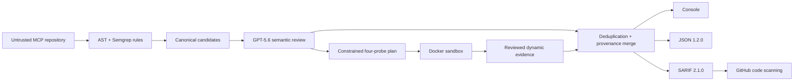

# MCP Sentinel

**Build-time security scanning for MCP servers.**

MCP Sentinel combines deterministic static rules, required GPT-5.6 semantic
review, and Docker-isolated adversarial probes. Every canonical finding maps to
the OWASP Agentic Top 10 and renders through the same console, JSON, and SARIF
2.1.0 report pipeline.

> **Status:** Phases 0–4 and the Phase 5 repository work are complete. The
> public video, Devpost entry, and release publication remain pending.

## Try Sentinel in three minutes

No source checkout or OpenAI API key is required. Install the prebuilt wheel,
then run the bundled GPT replay with real Docker probes.

### 1. Download the wheel

Until the `v0.1.0` GitHub Release is published, open the successful
[Phase 5 CI run](https://github.com/BashaarJavaid/MCP-Sentinel/actions/runs/29684340942),
download the `mcp-sentinel-wheel` artifact, and unzip it. GitHub may ask you to
sign in to download a workflow artifact. The archive contains:

```text
mcp_sentinel-0.1.0-py3-none-any.whl
```

### 2. Check Docker

Use Python 3.10, 3.11, or 3.12 and start Docker Engine on Linux or Docker
Desktop on macOS/Windows. Docker Desktop on Windows must use Linux containers.

```bash
docker info
docker buildx version
```

The first run may download Docker images and fixture dependencies through
Sentinel's restricted build network. The scanned server has no runtime network
access.

### 3. Install and run

macOS or Linux:

```bash
cd /path/to/unzipped-wheel
python3 -m venv sentinel-judge-env
source sentinel-judge-env/bin/activate
python -m pip install ./mcp_sentinel-0.1.0-py3-none-any.whl
sentinel --version
sentinel demo --replay-review --verbose
```

Windows PowerShell:

```powershell
cd C:\path\to\unzipped-wheel
py -3.12 -m venv sentinel-judge-env
.\sentinel-judge-env\Scripts\python.exe -m pip install .\mcp_sentinel-0.1.0-py3-none-any.whl
.\sentinel-judge-env\Scripts\sentinel.exe --version
.\sentinel-judge-env\Scripts\sentinel.exe demo --replay-review --verbose
```

The demo should exit `0` with `Status: COMPLETE`, evaluate all seven static
rules, and report `SENT-001` through `SENT-011`. It writes validated reports to:

```text
sentinel-demo-results/report.json
sentinel-demo-results/report.sarif
```

Validate the SARIF independently on macOS or Linux:

```bash
python -m sentinel.report.validate_sarif sentinel-demo-results/report.sarif
```

On Windows PowerShell:

```powershell
.\sentinel-judge-env\Scripts\python.exe -m sentinel.report.validate_sarif sentinel-demo-results\report.sarif
```

The validator produces no output when the report is valid and exits `0`. Replay
is prominently disclosed and makes no model call; checked responses captured
from GPT-5.6 still pass through the production parser, evidence and probe-plan
validators, all four real Docker probes, merge logic, and report validation.

See the accepted live
[`SENT-010` GitHub code-scanning alert](https://github.com/BashaarJavaid/mcp-sentinel-action-demo/security/code-scanning/10)
and the complete [Action evidence](artifacts/phase4-action-evidence.md).

## Architecture



Static analysis never imports or executes target code. Dynamic analysis runs
only local Python MCP targets in fresh containers with read-only source,
restricted build egress, no runtime network, resource limits, and forced
cleanup. GPT can order and bind four permanent inert templates; it cannot emit
executable probe code or create rule-less findings.

## What it checks

| Rule | Detection | OWASP | Impact |
|---|---|---|---|
| SENT-001 | Overly broad tool permission scope | ASI03:2026 | High |
| SENT-002 | Tool input reaches unsafe execution | ASI05:2026 | Critical |
| SENT-003 | Missing tool input validation | ASI02:2026 | Medium |
| SENT-004 | Unsanitized tool content enters a prompt | ASI01:2026 | High |
| SENT-005 | Hardcoded credential | ASI03:2026 | Critical |
| SENT-006 | Missing or ineffective route authentication | ASI03:2026 | High |
| SENT-007 | Unverified tool manifest | ASI04:2026 | Medium |
| SENT-008 | Out-of-scope tool execution | ASI02:2026 | Critical |
| SENT-009 | Oversized argument accepted | ASI05:2026 | Medium |
| SENT-010 | Injection payload executed | ASI05:2026 | Critical |
| SENT-011 | Malformed schema input processed | ASI02:2026 | Low |

See the [rule catalog](docs/rules.md) for boundaries, false-positive risks,
evidence, and remediation.

## Requirements and installation

Supported CLI environments are Python 3.10–3.12 on Linux, macOS, and Windows.
Full scans and demos require Docker Engine or Docker Desktop with Buildx. The
GitHub Action runs on Ubuntu.

Development checkout:

```bash
uv sync --extra dev
uv run sentinel --version
```

The pip-compatible development path is:

```bash
pip install -e ".[dev]"
```

Phase 5 CI builds one prebuilt `0.1.0` wheel and retains it in the
[successful workflow run](https://github.com/BashaarJavaid/MCP-Sentinel/actions/runs/29684340942).
The quickstart above shows the complete no-rebuild judge path. Install that
exact wheel directly with either package frontend:

```bash
python -m pip install mcp_sentinel-0.1.0-py3-none-any.whl
# or
pipx install mcp_sentinel-0.1.0-py3-none-any.whl
```

The package is not published to PyPI yet.

## CLI

```bash
# Complete static + GPT + Docker analysis
sentinel scan ./path/to/server

# Validated SARIF
sentinel scan ./path/to/server --format sarif --output results.sarif

# Static analysis plus required semantic review
sentinel scan ./path/to/server --static-only

# Explicitly allow unreviewed candidates when GPT is unavailable
sentinel scan ./path/to/server --static-only --allow-degraded

# Compact output is default; bounded evidence is opt-in
sentinel scan ./path/to/server --verbose
```

`--color/--no-color` overrides display detection. Otherwise `NO_COLOR` disables
style and interactive TTYs receive color. Presentation flags are rejected for
JSON/SARIF rather than silently ignored.

A normal scan requires `sentinel.target.yaml` and
`sentinel.permissions.yaml`. `--static-only` omits Docker and launch
configuration but still requires semantic review. `OPENAI_API_KEY` is read only
by Sentinel; it is never printed, persisted, forwarded to the target, or stored
by the Responses API.

Exit codes are stable:

| Code | Meaning |
|---:|---|
| 0 | Complete scan with no finding at the failure threshold |
| 1 | Complete scan with a finding at or above the threshold |
| 2 | Target or configuration error |
| 3 | GPT, Docker, Semgrep, report-validation, or internal failure |

Operational messages use `target error:`, `configuration error:`, and
`infrastructure error:` prefixes. `--debug` adds internal tracebacks.

## Judge demo

The wheel contains the vulnerable and clean fixtures, schemas, and GPT
cassettes. No source checkout is required.

```bash
# Offline GPT replay plus real Docker probes
sentinel demo --replay-review --verbose

# Live GPT review plus real Docker probes
export OPENAI_API_KEY=your-key
sentinel demo --verbose
```

Both commands atomically refresh validated reports under
`./sentinel-demo-results/`; use `--output-dir` to change the location. Expected
vulnerabilities make the demo successful, so a complete demo exits `0`.
Recorded review is prominently labeled and is never represented as a live call.
See the [judge runbook and narration](docs/demo.md).

## GPT-5.6 behavior and disclosure

The production reviewer uses the OpenAI Responses API with:

- requested model `gpt-5.6-sol` and recorded returned model ID;
- `store: false`;
- medium reasoning effort by default;
- strict Structured Outputs using the versioned review schema;
- deterministic context selection, redaction, batching, and candidate caps;
- validated source-range claims and constrained probe plans;
- current/origin latency, tokens, cache, failure, and micro-USD telemetry.

Live mode calls the model. Replay mode feeds checked live responses through the
same parser, validators, merge logic, dynamic probes, and reports. Degraded mode
is explicit, leaves candidates in `needs_review`, and remains fail-on eligible.
Suppressed candidates stay visible in every report with their reasoning.

## GitHub Action

```yaml
name: MCP Sentinel

on:
  pull_request:
  push:
    branches: [main]

permissions:
  contents: read
  security-events: write

jobs:
  scan:
    runs-on: ubuntu-latest
    steps:
      - uses: actions/checkout@v4
      - id: sentinel
        uses: BashaarJavaid/MCP-Sentinel@<immutable-commit-sha>
        with:
          target-path: .
          fail-on: high
          openai-api-key: ${{ secrets.OPENAI_API_KEY }}
```

The Action validates SARIF before upload and exposes `sarif-path`,
`findings-count`, and `highest-severity`. Fork pull requests receive no secret;
they run visibly degraded analysis and skip code-scanning upload. Non-fork runs
remain fail-closed. The preserved live proof is documented in
[`artifacts/phase4-action-evidence.md`](artifacts/phase4-action-evidence.md).

## Reports and reproducibility

```bash
python -m sentinel.schema check
python -m sentinel.report.validate_sarif results.sarif
make artifacts-check
make notices-check
```

`artifacts/example.sarif` is the checked live report.
`artifacts/gpt-ablation.json` compares rules-only, GPT-reviewed, and
dynamically proven outcomes over the versioned truth set. Routine generation
uses replay and Docker; the final live refresh is hard-capped:

```bash
make artifacts
MAX_USD=0.50 make artifacts-live
```

## Human, Codex, and GPT contribution

The human owner defined product scope, architecture, trust boundaries, threat
model, phase gates, and release decisions. Codex accelerated implementation,
tests, debugging, artifact automation, and documentation. GPT-5.6 changes the
runtime scanner by grounding semantic decisions and prioritizing constrained
probes; it does not replace deterministic detectors or the Docker boundary.

Primary Codex `/feedback` thread for core implementation:
`019f7469-e3ed-75a0-9906-7059299b1484`.

Supporting implementation threads:

- `019f70e6-a5fb-7f13-8eae-bca041fc37ad`
- `019f741f-cf91-7000-b12c-e9aa2a50ff03`
- `019f77a1-f2f0-7ab2-9a5d-e72fa1ebc40e`

Submit `/feedback` from the primary thread as required by the hackathon record.

## SecureMCP suite

Sentinel is the build-time security plane. SecureMCP Gateway provides runtime
zero-trust enforcement, while SecureMCP Identity brokers short-lived workload
credentials. Those projects are separate and out of scope here.

## License

MCP Sentinel is MIT licensed. Dependency licenses and packaged notice files are
recorded in [`THIRD_PARTY_NOTICES.md`](THIRD_PARTY_NOTICES.md).
