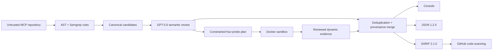

# MCP Sentinel

**Build-time security scanning for MCP servers.**

AI agents invoke tools exposed by MCP servers, and a single unsafe tool can leak
credentials, run arbitrary commands, or hijack the agent. MCP Sentinel catches
those holes before you ship — it scans an MCP server and reports the security
findings, each mapped to a known threat class.

It works in three layers: deterministic static rules find candidate issues,
GPT-5.6 reviews each one in context to cut false positives and order and
parameterize the probe plan, and a Docker-isolated sandbox runs the four probes
to confirm exploitable or unsafe runtime behavior. Every finding maps to the
OWASP Agentic Top 10 (the industry threat list for AI agents) and renders as
console, JSON, or SARIF — the standard format GitHub reads for its security tab.

*Want the overview before running anything? Jump to [What it checks](#what-it-checks)
and the [Architecture](#architecture) diagram.*

## Try Sentinel in three minutes

No source checkout or OpenAI API key is required. Install the prebuilt wheel,
then run the bundled GPT replay with real Docker probes.

### 1. Download the wheel

Download `mcp_sentinel-0.1.0-py3-none-any.whl` from the
[`v0.1.0` GitHub Release](https://github.com/BashaarJavaid/MCP-Sentinel/releases/tag/v0.1.0),
or use the [direct wheel download](https://github.com/BashaarJavaid/MCP-Sentinel/releases/download/v0.1.0/mcp_sentinel-0.1.0-py3-none-any.whl).
Its SHA-256 digest is:

```text
4672e63413e87bf750113c06a21133162d00f1e71ca6259a8394028c22b677aa
```

### 2. Check Docker

Use Python 3.10, 3.11, or 3.12 and start Docker Engine on Linux or Docker
Desktop on macOS/Windows. Docker Desktop on Windows must use Linux containers.

```bash
docker info
docker buildx version
```

The first run may download Docker images and fixture dependencies through
Sentinel's restricted build network. The scanned server has no runtime network
access.

### 3. Install and run

macOS or Linux:

```bash
cd /path/to/download-directory
python3 -m venv sentinel-judge-env
source sentinel-judge-env/bin/activate
python -m pip install ./mcp_sentinel-0.1.0-py3-none-any.whl
sentinel --version
sentinel demo --replay-review --verbose
```

Windows PowerShell:

```powershell
cd C:\path\to\download-directory
py -3.12 -m venv sentinel-judge-env
.\sentinel-judge-env\Scripts\python.exe -m pip install .\mcp_sentinel-0.1.0-py3-none-any.whl
.\sentinel-judge-env\Scripts\sentinel.exe --version
.\sentinel-judge-env\Scripts\sentinel.exe demo --replay-review --verbose
```

The demo should exit `0` with `Status: COMPLETE`, evaluate all seven static and
four dynamic rules, and report `SENT-001` through `SENT-011`. It writes
validated reports to:

```text
sentinel-demo-results/report.json
sentinel-demo-results/report.sarif
```

Validate the SARIF independently on macOS or Linux:

```bash
python -m sentinel.report.validate_sarif sentinel-demo-results/report.sarif
```

On Windows PowerShell:

```powershell
.\sentinel-judge-env\Scripts\python.exe -m sentinel.report.validate_sarif sentinel-demo-results\report.sarif
```

The validator produces no output when the report is valid and exits `0`. Replay
is prominently disclosed and makes no model call; checked responses captured
from GPT-5.6 still pass through the production parser, evidence and probe-plan
validators, all four real Docker probes, merge logic, and report validation.

See the accepted live
[`SENT-010` GitHub code-scanning alert](https://github.com/BashaarJavaid/mcp-sentinel-action-demo/security/code-scanning/10)
and the complete [Action evidence](artifacts/phase4-action-evidence.md).

## Architecture



Static analysis never imports or executes target code. Dynamic analysis runs
only local Python MCP targets in fresh containers with read-only source,
restricted build egress, no runtime network, resource limits, and forced
cleanup. GPT can order and bind four permanent inert templates; it cannot emit
executable probe code or create rule-less findings.

## What it checks

Each rule maps to a category in the OWASP Agentic Top 10; the `ASI0x:2026` codes
are that list's threat identifiers (e.g. `ASI03` is Identity & Privilege Abuse).

| Rule | Detection | OWASP | Impact |
|---|---|---|---|
| SENT-001 | Overly broad tool permission scope | ASI03:2026 | High |
| SENT-002 | Tool input reaches unsafe execution | ASI05:2026 | Critical |
| SENT-003 | Missing tool input validation | ASI02:2026 | Medium |
| SENT-004 | Unsanitized tool content enters a prompt | ASI01:2026 | High |
| SENT-005 | Hardcoded credential | ASI03:2026 | Critical |
| SENT-006 | Missing or ineffective route authentication | ASI03:2026 | High |
| SENT-007 | Unverified tool manifest | ASI04:2026 | Medium |
| SENT-008 | Out-of-scope tool execution | ASI02:2026 | Critical |
| SENT-009 | Oversized argument accepted | ASI05:2026 | Medium |
| SENT-010 | Injection payload executed | ASI05:2026 | Critical |
| SENT-011 | Malformed schema input processed | ASI02:2026 | Low |

See the [rule catalog](docs/rules.md) for boundaries, false-positive risks,
evidence, and remediation.

## Human, Codex, and GPT contribution

The human owner defined product scope, architecture, trust boundaries, threat
model, phase gates, and release decisions.

### How Codex was used

Codex was the implementation partner for the entire build. The working pattern
was design-first: before any implementation, a long Codex session worked through
scope and architecture — MVP versus deferred features, how findings map to OWASP
categories, the allowed state transitions for a finding, and whether semantic
review should be optional (it should not; a flag would have made it decorative).
That session is the architectural backbone the rest of the project was built
against.

From there Codex built the static rule engine and Semgrep adapter, the Docker
sandbox and probe harness, the reporting pipeline, the SARIF validator, the
cross-platform test matrix, artifact automation, and the documentation. It also
did the debugging on the harder cross-platform problems — Semgrep output parsing
and runtime-file isolation on Windows, and the two rounds of SARIF fixes needed
before GitHub code scanning would render the reports correctly.

The repository ships an [`AGENTS.md`](AGENTS.md) that constrains how Codex works
in this codebase: ask rather than assume, no speculative complexity, no
unrelated edits, explicit success criteria. Design decisions stayed with the
human owner; Codex accelerated everything downstream of them.

### How GPT-5.6 was used

GPT-5.6 is inside the shipped product, not just the build. It is load-bearing at
scan time: it reads the server code, decides which static candidates are real
findings, and orders and parameterizes the four probes the sandbox runs — turn it
off and you get different results. It does not replace the deterministic
detectors or the Docker boundary.

The constraints are the design: strict Structured Outputs against a versioned
schema, `store: false`, redacted and capped context, and host-validated source
ranges, so the model cannot cite a line that does not exist, invent a finding
outside the rule set, or emit executable probe code. See
[GPT-5.6 behavior and disclosure](#gpt-56-behavior-and-disclosure) for the full
runtime contract, and `artifacts/gpt-ablation.json` for a measured comparison of
rules-only, GPT-reviewed, and dynamically confirmed outcomes.

### Codex session record

Primary Codex `/feedback` thread for core implementation:
`019f70e6-a5fb-7f13-8eae-bca041fc37ad`.

Supporting implementation threads:

- `019f7469-e3ed-75a0-9906-7059299b1484`
- `019f741f-cf91-7000-b12c-e9aa2a50ff03`
- `019f77a1-f2f0-7ab2-9a5d-e72fa1ebc40e`

The Phase 5 `/feedback` record was submitted from the primary thread above.

## Requirements and installation

Supported CLI environments are Python 3.10–3.12 on Linux, macOS, and Windows.
Full scans and demos require Docker Engine or Docker Desktop with Buildx. The
GitHub Action runs on Ubuntu.

Development checkout:

```bash
uv sync --extra dev
uv run sentinel --version
```

The pip-compatible development path is:

```bash
pip install -e ".[dev]"
```

The [`v0.1.0` GitHub Release](https://github.com/BashaarJavaid/MCP-Sentinel/releases/tag/v0.1.0)
provides the prebuilt wheel produced by the
[successful release workflow](https://github.com/BashaarJavaid/MCP-Sentinel/actions/runs/29686427335).
It passed the Linux, macOS, and Windows test matrix, pip and pipx installation
smoke tests, and the installed-wheel Docker replay. Install that exact wheel
directly with either package frontend:

```bash
python -m pip install mcp_sentinel-0.1.0-py3-none-any.whl
# or
pipx install mcp_sentinel-0.1.0-py3-none-any.whl
```

The package is not published to PyPI yet.

## CLI

```bash
# Complete static + GPT + Docker analysis
sentinel scan ./path/to/server

# Validated SARIF
sentinel scan ./path/to/server --format sarif --output results.sarif

# Static analysis plus required semantic review
sentinel scan ./path/to/server --static-only

# Explicitly allow unreviewed candidates when GPT is unavailable
sentinel scan ./path/to/server --static-only --allow-degraded

# Compact output is default; bounded evidence is opt-in
sentinel scan ./path/to/server --verbose

# Set the failure threshold; default is high
sentinel scan ./path/to/server --fail-on critical
```

`--fail-on` accepts `critical`, `high`, `medium`, `low`, or `informational`, and
determines which findings produce exit code `1`.

`--color/--no-color` overrides display detection. Otherwise `NO_COLOR` disables
style and interactive TTYs receive color. Presentation flags are rejected for
JSON/SARIF rather than silently ignored.

A normal scan requires `sentinel.target.yaml` and
`sentinel.permissions.yaml`. `--static-only` omits Docker and launch
configuration but still requires semantic review. `OPENAI_API_KEY` is read only
by Sentinel; it is never printed, persisted, forwarded to the target, or stored
by the Responses API.

Exit codes are stable:

| Code | Meaning |
|---:|---|
| 0 | Complete scan with no finding at the failure threshold |
| 1 | Complete scan with a finding at or above the threshold |
| 2 | Target or configuration error |
| 3 | GPT, Docker, Semgrep, report-validation, or internal failure |

Operational messages use `target error:`, `configuration error:`, and
`infrastructure error:` prefixes. `--debug` adds internal tracebacks.

## Judge demo

The wheel contains the vulnerable and clean fixtures, schemas, and GPT
cassettes. No source checkout is required.

```bash
# Offline GPT replay plus real Docker probes
sentinel demo --replay-review --verbose

# Live GPT review plus real Docker probes
export OPENAI_API_KEY=your-key
sentinel demo --verbose
```

Both commands atomically refresh validated reports under
`./sentinel-demo-results/`; use `--output-dir` to change the location. Expected
vulnerabilities make the demo successful, so a complete demo exits `0`.
Recorded review is prominently labeled and is never represented as a live call.
See the [judge runbook and narration](docs/demo.md).

## GPT-5.6 behavior and disclosure

The production reviewer uses the OpenAI Responses API with:

- requested model `gpt-5.6-sol` and recorded returned model ID;
- `store: false`;
- medium reasoning effort by default;
- strict Structured Outputs using the versioned review schema;
- deterministic context selection, redaction, batching, and candidate caps;
- validated source-range claims and constrained probe plans;
- current/origin latency, tokens, cache, failure, and micro-USD telemetry.

Live mode calls the model. Replay mode feeds checked live responses through the
same parser, validators, merge logic, dynamic probes, and reports. Degraded mode
is explicit, leaves candidates in `needs_review`, and remains fail-on eligible.
Suppressed candidates stay visible in every report with their reasoning.

## GitHub Action

```yaml
name: MCP Sentinel

on:
  pull_request:
  push:
    branches: [main]

permissions:
  contents: read
  security-events: write

jobs:
  scan:
    runs-on: ubuntu-latest
    steps:
      - uses: actions/checkout@v4
      - id: sentinel
        uses: BashaarJavaid/MCP-Sentinel@ee91e07d0fa78106dbb6d85b60bd8288173abd23
        with:
          target-path: .
          fail-on: high
          openai-api-key: ${{ secrets.OPENAI_API_KEY }}
```

The Action validates SARIF before upload and exposes `sarif-path`,
`findings-count`, and `highest-severity`. Fork pull requests receive no secret;
they run visibly degraded analysis and skip code-scanning upload. Non-fork runs
remain fail-closed. The preserved live proof is documented in
[`artifacts/phase4-action-evidence.md`](artifacts/phase4-action-evidence.md).

## Reports and reproducibility

```bash
python -m sentinel.schema check
python -m sentinel.report.validate_sarif results.sarif
make artifacts-check
make notices-check
```

`artifacts/example.sarif` is the checked live report.
`artifacts/gpt-ablation.json` compares rules-only, GPT-reviewed, and
dynamically confirmed outcomes over the versioned truth set. Routine generation
uses replay and Docker; the final live refresh is hard-capped:

```bash
make artifacts
MAX_USD=0.50 make artifacts-live
```

## License

MCP Sentinel is MIT licensed. Dependency licenses and packaged notice files are
recorded in [`THIRD_PARTY_NOTICES.md`](THIRD_PARTY_NOTICES.md).
