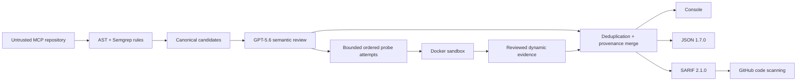

# PortunusMCP Sentinel

## Current v65 invalidation attempt: strict-equivalence failure retained

The approved If invalidation-accumulator attempt passes **256 ordinary full-state
comparisons**, then fails the required synthetic captured-arm alias and shrinking-arm
controls. Error/interruption states agree. Shipped source has no matching removal or
arm-set export; real-target reachability remains unestablished. The strict proposal
still required these controls. **One failed attempt closed; exact tested `1948bf9`
source restored.** The candidate and the initial helper-deadline correction remain.

`v65-if-invalidation-accumulator/optimization-proposal.json` prepares an **unapproved
explicit mutation-domain revision and one new source-only attempt**. Every shipped
writer/reader/subclass must first prove monotone private sets with no escaping arm
alias. Only the two named injected callbacks would become negative controls outside
that prospective domain after explicit approval; their original failures stay failed.
No current reclassification, implementation, corpus/profile/retry, paid call,
resource change or timeout revision is authorized. Full engineering remains required
if a later explicitly approved attempt passes its complete prerequisites.

All **365 requirements (89 original + 276 added)** and every earlier failed gate
remain. Restored `1948bf9` retains **2,418 tests / 36 skips** locally and in all 12
hosted suites, 29 normal CI jobs and docs passed; combined coverage 90.08%,
branch-only 85.92%. Six zero-call production replays and approved runtime bindings
remain compatible. This adds failed-attempt/restoration and docs/package checks,
not a new candidate engineering or hosted code pass.

**Phase 22 remains incomplete**, pending current-source gates, explicit human
technical acceptance and accepted closeout. Git stays 312/1,040 incomplete;
paid benchmark/pilots deferred, Phase 21 incomplete and Phase 24/15 unchanged.
No merge, ready-state change, release, outreach or Phase 23 is authorized.

## Historical v64 parent-and-worker profile: source-only decision pending

The approved single FAF profile at frozen **`1948bf9`** timed out after
**1800.010375 seconds**, retaining **148,764 partial samples**
from **1 verified process snapshot(s): parent**. Cleanup passed;
no report exists and the one-use budget is closed. Parent and worker denominators
are separate. Missing worker snapshots do not prove workers never launched.
Partial shares establish no native speedup, removable-cost fraction or detection.

`v64-shared-discovery-sampling/optimization-proposal.json` prepares **one unapproved
source-only attempt** to avoid redundant If invalidation-accumulator construction.
The original baseline and every per-arm copy, guard, traversal and state update remain.
Complete branch-isolation, alias/state and report equivalence plus full engineering
are required. No implementation, corpus/profile/retry, paid call,
resource change or timeout revision is included. The 1800-second policy remains.

All **358 requirements (89 original + 269 added)** and every earlier failed gate
remain. Product retains tested `1948bf9`: **2,418 tests / 36 skips** locally and in
all 12 hosted suites, 29 normal CI jobs and docs passed. Combined coverage is
90.08%, branch-only 85.92%; six zero-call replays and approved runtime bindings
remain compatible. This continuation adds profile assessment and docs/package checks.

**Phase 22 remains incomplete**, pending current-source gates, explicit human
technical acceptance and accepted closeout. Git stays 312/1,040 incomplete;
paid benchmark/pilots deferred, Phase 21 incomplete and Phase 24/15 unchanged.
No merge, ready-state change, release, outreach or Phase 23 is authorized.

## Historical v63 shared-discovery regression: timed out, budget closed

The approved 205-observation sequence at frozen **`1948bf9`** stopped on its first
FAF vulnerable input after **1800.010893 seconds** whole-input time.
**One incomplete, zero reports, 204 unstarted closed, zero remaining.** Cleanup passed
in its separate 15-second allowance. Detection, findings, fixed/control support and
ordered repeats remain unknown. No retry, profile, target execution or paid call ran.

`v63-shared-discovery-regression/diagnostic-proposal.json` prepares **one unapproved,
unexecuted parent-and-worker sampled FAF input**, maximum 1800 seconds plus 15 seconds
cleanup. Completed discovery now runs in the parent before worker dispatch; old
worker-only samples cannot establish current costs. Reuse the same CPU-timer sampler
in the parent and existing workers, with actual source identities verified before
timers/target access. Six-vector, stale-root, parent completion/interruption and
missing-approval controls pass. Sampling overhead and incomplete intervals remain
explicit; no optimization, resource/deadline change or speedup claim is included.

All **352 requirements (89 original + 263 added)** remain, including six native timeouts,
four valid partial profiles, invalid stale-root preparation, both singleton failures
and six unaccepted historical closure proposals. Product retains tested `1948bf9`:
**2,418 tests/36 skips** locally and all 12 hosted suites, 29 normal CI jobs and docs passed;
combined coverage 90.08%, branch-only 85.92%. Six zero-call production replays and
approved runtime/image bindings remain compatible; this adds outcome/preparation
and final docs/package checks, not another hosted code pass.

**Phase 22 remains incomplete**, pending actual current-source gates, explicit human
technical acceptance and accepted closeout. Git stays 312/1,040 incomplete, 728 deferred;
paid benchmark/pilots deferred, Phase 21 incomplete, Phase 24/15 unchanged. No merge,
ready-state, release, outreach or Phase 23 is authorized.

## Historical v62 shared discovery: engineering passed, regression approval pending

The approved single source-only discovery-reuse attempt is engineering-verified at
**`1948bf9`**, source `8f88940210e0f382f8c1cfa1b8af3bf7464ecb891122ae23539de1e4806fc408`.
The original traversal is preserved; completed TypeScript registration discovery is
shared through the existing four-worker IPC and parent coverage. Ordered warnings,
source-node aliases, option effects and all rule-specific analyses remain intact.
Synthetic checks include 125 complete baseline comparisons, complete worker reports,
empty/failed/deadline cases and one producer with every detector still invoked.
No native speedup or 1800-second completion has been established.

Local and all 12 hosted suites pass **2,418 tests / 36 skips**; all **29 normal CI
jobs** and docs pass in **34793663094 / 34793663105**. Combined statement/branch
coverage is **90.08%**, branch-only **85.92%**. Six complete production
requests replay identically with zero paid calls; approved runtime/image bindings
remain compatible. Initial fixture/import/format check errors retain their corrections.

`v62-shared-tool-discovery/evaluation-proposal.json` prepares **205 exposed observations,
110 inputs and 95 entire ordered pairs**, **unapproved and unexecuted**: 24 four-source,
94 TypeScript and 87 Python. The shared 1800-second input limit, 15-second cleanup,
120-second informational target and 6275-minute outer cap remain unchanged. The outer
cap is a worst-case bound, not a duration estimate. No retry/profile/comparator,
new repository, target execution or paid call is included.

All **345 requirements (89 original + 256 added)** retain every earlier failed gate,
five native timeouts, four valid partial profiles, invalid stale-root preparation,
both singleton failures and six unaccepted historical closure proposals. No old budget
is reopened. **Phase 22 remains incomplete**, pending current-source gates, separate
explicit human technical acceptance and accepted closeout. Git stays **312/1,040
incomplete**, 728 deferred; paid benchmark/pilots deferred, Phase 21 incomplete and
Phase 24/15 unchanged. No merge, ready-state, release, outreach or Phase 23.

## Historical v61 thirty-minute profile: source-only decision pending

The approved FAF profile at frozen **`7bf4c6e`** timed out after
**1800.090669 seconds**, retaining **four verified worker identities
and 432,756 partial samples**. Cleanup passed; no report exists and the
one-use budget is closed. Registration discovery appears in **99.93–99.93%**
of each worker's retained samples. These overlapping partial shares do not prove
native speedup, removable-cost fraction, detection or compatibility.

`v61-faf-long-timeout-sampling/optimization-proposal.json` prepares **one unapproved
source-only attempt** to reuse completed TypeScript tool discovery across the
existing workers and coverage. Preserve ordered warnings and source-node identity;
all rule-specific analysis still executes. Full synthetic/engineering verification
is required. No implementation, corpus/profile/retry/comparator, target execution,
paid call, resource change or timeout revision is included in current approval.
The shared 1800-second policy remains in place.

All **335 requirements (89 original + 246 added)** and every earlier failed gate
remain. Product/tests retain verified `7bf4c6e`: **2,403 tests / 36 skips** locally
and in all 12 hosted suites, 29 normal CI jobs and docs passed. Combined coverage
is 89.98%, branch-only 85.86%; six zero-call replays and approved runtime bindings
remain compatible. This continuation adds profile assessment and docs/package checks.

**Phase 22 remains incomplete**, pending current-source gates, explicit human
technical acceptance and accepted closeout. Git stays 312/1,040 incomplete;
paid benchmark/pilots deferred, Phase 21 incomplete and Phase 24/15 unchanged.
No merge, ready-state change, release, outreach or Phase 23 is authorized.

## Historical v60 thirty-minute regression: timed out, budget closed

The approved 205-observation sequence at frozen **`7bf4c6e`** stopped on the first
FAF vulnerable input after **1800.021672 seconds**. **One incomplete,
zero reports, 204 unstarted closed and zero remaining**; cleanup passed. Findings,
detection, fixed/control discrimination and ordered repeats remain unknown.
The approved 1800-second shared policy remains in place; extending the deadline
alone did not establish completion. No retry, profile or paid call occurred.

`v60-long-timeout-regression/diagnostic-proposal.json` prepares **one sampled FAF
input**, **unapproved and unexecuted**, with a 1800-second maximum and 15-second
cleanup allowance. Existing sampler/worker layout, synthetic identity/timer and
missing-approval checks pass. Older `a36f696` samples do not establish current costs.
No optimization, uninstrumented run, comparator or target execution is included.

All **329 requirements (89 original + 240 added)** remain, including five native
timeouts, three valid partial profiles, invalid stale-root preparation, both
singleton failures and six unaccepted historical closure proposals. Product and
tests remain verified `7bf4c6e`: **2,403 tests / 36 skips** locally and in all 12
hosted suites, 29 normal CI jobs and docs passed. Combined coverage is 89.98%,
branch-only 85.86%; six zero-call replays and approved runtime bindings remain.
This continuation adds outcome, preparation and docs/package checks.

**Phase 22 remains incomplete**, pending current-source gates, explicit human
technical acceptance and accepted closeout. Git stays 312/1,040 incomplete;
paid benchmark/pilots deferred, Phase 21 incomplete and Phase 24/15 unchanged.
No merge, ready-state change, release, outreach or Phase 23 is authorized.

## Historical v59 timeout policy: engineering passed, evaluation pending

The user confirmed **30 minutes per input**. The shared static deadline is now
1,800 seconds at **`7bf4c6e`**, source `40c194dcd47a152f78c9b9dc57b40e5e77026f6052035841c0af63b83f234af6`;
120 seconds remains informational. Source proof establishes one product AST
literal change; detector logic and cleanup are unchanged from `dc73715`.
Local and all 12 hosted suites pass **2,403 tests / 36 skips**; all 29 normal jobs
and docs pass in 34784085204 / 34784085193. Six production requests replay with
zero paid calls. Actual engineering and runtime bindings are retained.

`v59-timeout-policy/evaluation-proposal.json` is **unapproved and unexecuted**:
205 exposed observations, 110 input records, 95 ordered pairs; 30-minute input
ceiling, 15-second cleanup and 6,275-minute outer cap. This is a worst-case cap,
not a duration estimate. All original conditions, support requirements and
11 volatile exclusions remain. No retry, profile, comparator, new repository,
target execution or paid call. The pending v58 diagnostic is preserved unexecuted.

All four earlier native timeouts, partial/invalid profiles, singleton failures
and original fresh failures remain source-bound and unaccepted. No speedup,
current-source compatibility or new unseen-source discrimination is established.
The audit retains **323 rows (89 original + 234 added)**, including all 314 prior
rows and six unaccepted historical closure proposals. **Phase 22 is incomplete**:
actual regression, source assessment, explicit human acceptance and closeout remain.
Git stays 312/1,040 incomplete; paid benchmark/pilots deferred, Phase 21 incomplete
and Phase 24/15 unchanged. No merge, ready-state, release, outreach or Phase 23.

## Historical v58 credential regression timeout: budget closed

The approved 205-observation sequence at frozen **`dc73715`** stopped on the first
FAF vulnerable input at **300.005621 seconds** whole-input time.
**One incomplete, zero reports, 204 unstarted closed, zero remaining**; cleanup
passed. Detection, findings, fixed/control discrimination and ordered repeats are
unknown. Current-source four-repository and prior-language gates remain unresolved.
No retry, profile, comparator, target execution or paid call occurred.

`v58-credential-regression/diagnostic-proposal.json` prepares **one sampled FAF
input**, **unapproved and unexecuted**, with a 300-second maximum and 15-second
cleanup allowance. The existing sampler and worker layout remain unchanged;
actual worker/flow/source identities are verified before timer or target access.
Synthetic identity/timer checks and the missing-approval boundary pass.
Earlier `a36f696` samples do not establish residual costs at the corrected source.
No optimization, resource/deadline change or further measurement is authorized.

All **314 requirements (89 original + 225 added)** remain. All four native
timeouts, three partial profiles, invalid stale-root preparation, both singleton
failures and six unaccepted historical closure proposals retain their actual
source bindings. Product and tests remain engineering-tested `dc73715`: **2,399
tests / 36 skips** locally and in all 12 hosted suites, all 29 normal CI jobs and
docs passed. Combined coverage is 89.98%, branch-only 85.86%; six zero-call
production replays and approved runtime/image bindings remain compatible.

**Phase 22 remains incomplete**, pending current-source gates, explicit human
technical acceptance and accepted closeout. Git stays 312/1,040 incomplete;
paid benchmark/pilots deferred, Phase 21 incomplete and Phase 24/15 unchanged.
No merge, ready-state change, release, outreach or Phase 23 is authorized.

## Historical v57 joint correction: engineering passed, regression pending

The approved equal-marker credential correction and canonical unknown bypass
are verified at **`dc73715`**, source `4f3e5b2e9c89f61d179ac82db94ced06e83033f9cf1640644cefb53326e96eb9`.
Across 4,050 correction cases, 552 marker and 552 derived cache-input deltas retain
the explicitly revised join contract; guard results agree. The bypass then
passes 2,430 complete Python/TypeScript state comparisons and two saturated-cache
evictions against a preserved correction-only reference. Seven existing synthetic
HTTP patterns preserve entire ordered rule output: four detections, three negatives.
Both original singleton failures remain reproduced, closed and unaccepted.

Local and all 12 hosted suites pass **2,399 tests / 36 skips**; all 29 normal CI jobs
and docs pass in 34779741236 / 34779741226. Combined local coverage is
89.98%, branch-only 85.86%. Packages, strict quality checks, six identical zero-call
production requests and approved runtime bindings pass. Initial synthetic fixture,
import-root and test-format check failures retain their individual corrections.

`v57-credential-merge/evaluation-proposal.json` is **unapproved/unexecuted**:
205 exposed observations on 110 inputs / 95 ordered pairs, comprising 24 four-source,
94 TypeScript and 87 Python observations. 120-second target, 300-second whole/native
maximum, 15-second cleanup, 1,150-minute outer sequence; zero retries, profiles,
comparators, target execution or paid calls. No speedup or 300-second completion
is established. All old timeouts, partial/invalid profiles and fresh failures
remain source-bound; no partial subsets become new whole Linux batches.

The audit retains **308 requirements (89 original + 219 added)**, including six
unaccepted historical closure proposals and both failed singleton rows.
**Phase 22 remains incomplete**, awaiting actual regression, explicit human
technical acceptance and accepted closeout. Git stays 312/1,040 incomplete;
paid benchmark/pilots deferred, Phase 21 incomplete and Phase 24/15 unchanged.
No merge, ready-state change, release, outreach or Phase 23 is authorized.

## Historical v56 canonical bypass: eviction failure retained

The approved canonical `UNKNOWN_VALUE` bypass passes the two retained ordinary
identity cases, then fails synthetic environment equivalence after LRU eviction.
Skipping an empty entry changes whether a tainted value remains interned; the
identity-only credential-marker join then returns different environments. Full
flow fields agree and inputs are unchanged. Real-target reachability/impact of
the adversarial contained-false marker remains unestablished. **One attempt
consumed, zero remaining; exact tested `a36f696` source restored.**

`v56-canonical-unknown/optimization-proposal.json` prepares an **unapproved
prospective contract revision**: equal immutable credential markers would join
consistently by identity or complete equality, followed by the canonical bypass.
The specified baseline marker delta must remain visible; bypass equivalence must
then hold against a correction-only reference with no exclusions. Neither edit
is implemented. No speedup or 300-second completion is promised. No corpus,
profile, retry, target execution or paid call is included.

All prior native/profile/fresh failures and both singleton failures remain
source-bound and closed. The audit retains **297 rows (89 original + 208 added)**,
including six unaccepted historical closure proposals. Restored `a36f696`
retains 2,386 tests / 36 skips locally and in all 12 hosted suites, 29 normal CI
jobs and docs passed; combined coverage 89.98%, branch-only 85.85%. This is no
new hosted code pass. **Phase 22 remains incomplete.** Git stays 312/1,040
incomplete; paid benchmark/pilots deferred, Phase 21 incomplete, Phase 24/15
unchanged. No merge, ready-state change, release, outreach or Phase 23.

## Historical v55 singleton attempt: equivalence failure retained

The approved broad singleton cache bypass failed its synthetic environment
equivalence prerequisite and was reverted. A warm cache interns equal Values;
direct return changes identity-sensitive credential-marker merging for a tainted
contained-false internal state. Real-target reachability of that state is not
established. Initial whole-flow comparison flags were a helper-object comparison
defect; structural reassessment preserves equal full flow state and confirms the
independent environment delta. All evidence remains visible. **One failed attempt
consumed, zero remaining; product restored exactly to tested `a36f696`.**

`v55-singleton-combine/optimization-proposal.json` prepares one **unapproved,
unimplemented** attempt restricted to the canonical `UNKNOWN_VALUE` singleton
and empty requested key. Every other input must retain cache dispatch. Complete
state and interning checks remain required; eligibility frequency and speedup
are unknown. No corpus/profile/retry, target execution or paid call is authorized.

All three native timeouts, partial profiles, invalid stale-root attempt and
original fresh failures remain source-bound. The audit retains **290 rows
(89 original + 201 added)**, including six unaccepted historical closure proposals
and the new unresolved equivalence failure. Restored `a36f696` retains 2,386 tests /
36 skips in local and all 12 hosted suites, 29 normal CI jobs and docs passed;
combined coverage 89.98%, branch-only 85.85%. This is no new hosted code pass.
**Phase 22 remains incomplete.** Git remains 312/1,040 incomplete; paid benchmark
and pilots deferred, Phase 21 incomplete and Phase 24/15 unchanged. No merge,
ready-state change, release, outreach or Phase 23 is authorized.

## Historical v54 sampled timeout: source-only decision pending

The approved single profile at frozen **`a36f696`** retains **four verified worker
identities and 78,769 partial samples**. Whole input **300.007176 seconds**;
cleanup passed, no report exists and the one-use budget is closed. Registration
traversal dominates; merge is 33.09–33.73% inclusive and shared combine/cache call
is 7.40–7.64% leaf sample share. These overlapping partial shares establish no
native speedup, removable-cost fraction or 300-second completion.

`v54-faf-fastpath-sampling/optimization-proposal.json` proposes **one unapproved
source-only singleton fast path** before the existing value-combination cache.
Only an unchanged sole Value with no key override or required safety stripping
could bypass the tuple/cache call. All other paths, cache and complete flow state
must remain compatible, including cold/warm and identity-sensitive controls.
No implementation, corpus/profile/retry, new cache, resource/deadline change or
paid call is authorized. Eligible-case prevalence remains unmeasured.

All three native timeouts/204 closed remainders, prior partial profiles, invalid
stale-worker preparation and original fresh failures remain unchanged. The audit
retains **283 requirements (89 original + 194 added)** and six unaccepted historical
closure proposals. Product retains tested `a36f696`: 2,386 tests / 36 skips locally
and in all 12 hosted suites, 29 normal CI jobs and docs passed; combined coverage 89.98%,
branch-only 85.85%, six unchanged zero-call production requests and runtime bindings.
**Phase 22 remains incomplete.** Git stays 312/1,040 incomplete with 728 deferred;
paid benchmark/pilots deferred, Phase 21 incomplete and Phase 24/15 unchanged.
No merge, ready-state change, release, outreach or Phase 23 is authorized.

## Historical v53 fast-path regression timeout: budget closed

The approved 205-observation sequence at frozen **`a36f696`** stopped on its first
FAF vulnerable input at **300.000481 seconds** whole-input time.
**One incomplete, zero reports, 204 unstarted closed, zero remaining**; cleanup
passed. Findings, guards, negative discrimination and ordered repeats are unknown.
Corrected four-source and prior-language compatibility gates remain unestablished.
No retry, profile, target execution or paid call occurred. All earlier failures
and original fresh outcomes remain preserved with their actual scanner identities.

The next **single 300-second sampled FAF input** is prepared, **unapproved and
unexecuted** in `v53-fastpath-regression/diagnostic-proposal.json`. It retains the
existing CPU-timer sampler, source/configuration and worker layout, with verified
actual worker/flow/scanner identities before timer or target snapshot access.
The stale-root synthetic control and missing-approval boundary pass. Earlier
`6e4fd67` samples cannot establish remaining costs after the current reorder.
No further optimization, retry, resource/deadline change or paid call is authorized.

All **277 requirements (89 original + 188 added)** remain, including six unaccepted
historical closure proposals and the unresolved invalid stale-worker preparation.
Product/tests/workflows remain `a36f696`: 2,386 tests / 36 skips locally and in all
12 hosted suites; 29 normal CI jobs and docs passed, combined coverage 89.98% and
branch-only 85.85%. Six zero-call production requests and runtime bindings persist.
**Phase 22 remains incomplete.** Git stays 312/1,040 incomplete with 728 deferred;
paid benchmark/pilots deferred, Phase 21 incomplete and Phase 24/15 unchanged.
No merge, ready-state change, release, outreach or Phase 23 is authorized.

## Historical v52 equal-value fast path: regression approval pending

The one approved source-only merge reorder is engineering-verified at **`a36f696`**.
It checks eligible equal values actually present in every branch before preparing
record fallbacks. **10,944 synthetic comparisons** preserve environment, complete
flow state and inputs; eight intended cases skip the registry lookup and all 13
needed defaults remain. No native speedup or 300-second completion is established.
Full local and all 12 hosted suites pass **2,386 tests / 36 skips**; local combined
statement/branch coverage **89.98%**, branch-only **85.85%**. All 29 normal CI jobs
and docs pass in **34767417083 / 34767417081**, with exact checkout/package bindings.
Six unchanged production requests checked-replay with zero model calls. No new
corpus observation, profile or Git campaign ran.

The **205-observation exposed regression** is prepared, **unapproved and unexecuted**:
24 four-source + 94 TypeScript + 87 Python, 110 inputs and 95 whole ordered pairs.
Bounds: 120-second target, 300-second native/whole maximum, 15-second cleanup, one
1,150-minute serial local sequence. No retries, profiles, comparators, new repository,
target execution or paid calls. See `v52-merge-fastpath/evaluation-proposal.json`
and `launcher-binding.json`. Earlier shared recovery still lacks completed corpus
validation, so both language schedules remain necessary; they are no new whole
Linux batch. Every original label, qualifier and source-support condition remains.

Both earlier native timeouts/204 closed remainders, sampled timeouts, invalid stale
worker preparation and all original fresh failures remain preserved. The corrected
v51 partial profile does not erase the invalid attempt or establish a native pass.
All **271 requirements (89 original + 182 added)** remain; six historical closure
proposals, corrected gates and human technical acceptance are unresolved.
**Phase 22 remains incomplete.** Git stays 312/1,040 incomplete with 728 deferred;
paid benchmark/pilots deferred, Phase 21 incomplete and Phase 24/15 unchanged.
No merge, ready-state change, release, outreach or Phase 23 is authorized.

## Historical v51 bound profile: source-only decision pending

The approved corrected profile at frozen `6e4fd67` retains **four verified worker
identities and 79,307 partial samples**. Its whole input timed out at 300 seconds;
cleanup passed, no report exists, and the one-use budget is closed. Shared
TypeScript branch merge is 43.02–44.46% inclusive sample share; its missing-branch
predicate is 8.40–9.08% leaf share. These are not speedup or removable-cost claims.
The [review packet](artifacts/phase22/integration/v51-faf-bound-sampling/summary.md) proposes **one unapproved source-only optimization**:
recognize eligible all-present equal branch values before fallback preparation.
No implementation, corpus/profile/retry, resource change or paid call is authorized.
The invalid old-root profile and V49 preparation failure remain preserved; this
passes current diagnostic attribution only. Original native/fresh failures remain.
Product retains tested `6e4fd67`: 2,384 tests / 36 skips locally and in all 12 hosted
suites, 29 normal jobs and docs passed; combined coverage 89.98%, branch-only
85.85%. All **265 requirements** remain. **Phase 22 is incomplete**; explicit
human acceptance is separate. Git stays 312/1,040 incomplete, paid benchmark and
pilots deferred, Phase 21 incomplete and Phase 24/15 unchanged. No merge,
ready-state, release, outreach or Phase 23.


## Historical v50 profile binding failure: stopped and closed

The approved single profile was deliberately stopped when the reused sampler's
worker import root was found to be `17b4784` instead of approved `6e4fd67`.
**One invalid interrupted attempt, no report or sample snapshot, zero remaining.**
Cleanup inventory is empty. Parent identity does not prove worker identity;
V49-DIAGNOSTIC-PREPARATION is corrected to unresolved with its prior row preserved.
The [review packet](artifacts/phase22/integration/v50-faf-allocation-sampling/summary.md) retains this agent preparation error and the diagnostic-only
correction: actual worker/flow imports and full scanner identity checked before
sampling or target snapshot access, with a stale-root rejection control.
A new **single 300-second profile is unapproved and unexecuted**; no retry,
optimization or paid call is authorized. Prior native timeouts and all four
first-frozen failures remain unchanged. Product retains tested `6e4fd67`:
2,384 tests / 36 skips locally and in all 12 hosted suites; 29 normal jobs and
docs passed, combined coverage 89.98%, branch-only 85.85%. All 259 requirements
remain. **Phase 22 is incomplete**; human acceptance is separate. Git stays
312/1,040 incomplete; paid benchmark/pilots deferred, Phase 21 incomplete and
Phase 24/15 unchanged. No merge, ready-state, release, outreach or Phase 23.


## Historical v49 allocation regression timeout: budget closed

The approved 205-observation sequence at frozen `6e4fd67` stopped on its first
FAF vulnerable input at the 300-second whole-input maximum: **one incomplete,
zero completed reports, 204 unstarted closed, zero remaining**. Cleanup passed.
No finding, guard, negative-path or ordered-repeat result is available; corrected
four-repository and prior-language compatibility gates remain unestablished.
The [review packet](artifacts/phase22/integration/v49-allocation-regression/summary.md) retains the failure and an **unapproved single
300-second CPU-sampling diagnostic** on the same FAF input. No new retry, profile,
target execution or paid call occurred in this sequence. The v47 profile remains
bound to the earlier scanner; another optimization is not authorized. All original fresh failures and
historical source-bound passes remain unchanged. Engineering retains `6e4fd67`:
2,384 tests / 36 skips locally and in all 12 hosted suites, 29 normal CI jobs and
docs passed; combined coverage 89.98%, branch-only 85.85%. The audit retains all
253 requirements. **Phase 22 remains incomplete**; no failure/limitation or human
technical acceptance is inferred. Git stays 312/1,040 incomplete; paid benchmark
and pilots deferred, Phase 21 incomplete and Phase 24/15 unchanged. No merge,
ready-state change, release, outreach or Phase 23.


## Historical v48 allocation candidate: regression approval pending

The approved single source-only merge optimization is engineering-verified at
**`6e4fd67`**. It avoids constructing unused record fallbacks; **10,944 synthetic
comparisons** preserve environment, complete flow state and inputs. Allocation
checks preserve needed fallbacks. Full local and all 12 hosted suites pass
**2,384 tests / 36 skips**; local combined statement/branch coverage is
**89.98%**, branch-only **85.85%**. All **29 normal CI jobs** and docs
pass in **34743452798 / 34743452818**, with exact candidate checkout/package
bindings. Six production requests checked-replay unchanged with zero model calls;
Git runtime/image remains compatible. No new corpus observation or profile ran.

The new **205-observation exposed regression** is prepared, **unapproved and
unexecuted**: 24 four-repository, 94 TypeScript and 87 Python, on 110 inputs and
95 ordered repeat pairs. Bounds are 120-second target, 300-second native/whole
maximum, 15-second cleanup and one 1,150-minute serial local sequence; no retry,
profile, comparator, new repository, target execution or paid call. Exact scope
is in `v48-merge-allocation/evaluation-proposal.json` and `launcher-binding.json`.
The earlier shared source recovery still lacks completed corpus validation, so
both prior-language schedules remain necessary. Synthetic allocation reduction
establishes no native speedup or 300-second completion. The old native timeout
and 204 unstarted closed, sampled timeout and all original fresh failures remain
unchanged. No closed budget is reused and no failed gate is waived.

The audit retains **all 247 requirements**, including 89 original and 158 added
rows. Corrected corpus gates, six historical closure decisions and explicit human
technical acceptance remain unresolved. **Phase 22 remains incomplete.** Git
campaigns stay 312/1,040 incomplete with 728 deferred; paid benchmark/pilots stay
deferred, Phase 21 incomplete and Phase 24/15 unchanged. No merge, ready-state
change, release, outreach or Phase 23 is authorized.

## Historical v47 sampled timeout: source-only proposal pending

The separately approved single FAF worker profile at frozen `17b4784` timed out
at 300 seconds with verified cleanup: **one incomplete sampled input, four partial
snapshots / 86,659 samples, no report, zero budget remaining**. The [review packet](artifacts/phase22/integration/v47-faf-sampling/summary.md)
attributes 58.36–59.06% of worker samples inclusively to TypeScript branch merging
and 25.78–26.41% as leaves in its fallback Value constructor. These overlapping
sample shares are not promised savings; unused allocations remain uncounted.
One narrow **source-only fallback-allocation optimization** is proposed, unapproved
and unstarted, with zero new corpus/profile/paid budget. The prior regression's
one incomplete attempt and 204 closed unstarted observations remain unchanged.
Corrected detection/compatibility gates remain unresolved. Engineering retains
tested `17b4784`: 2,380 tests / 36 skips locally and in all 12 hosted suites,
29 normal CI jobs and docs passed; combined coverage 89.98%, branch-only 85.85%.
All 239 audit rows and original fresh failures remain. **Phase 22 is incomplete**;
no limitation or human technical acceptance is inferred. Git remains 312/1,040
incomplete, paid benchmark/pilots deferred, Phase 21 incomplete and Phase 24/15
unchanged. No optimization, retry, paid call, target execution, merge, ready-state,
release, outreach or Phase 23 occurred or is newly authorized.


## Historical v46 regression timeout: budget closed

The approved 205-observation sequence at frozen `17b4784` stopped on its first
FAF vulnerable input at the 300-second whole-input maximum: **one incomplete,
zero completed reports, 204 unstarted closed, zero remaining**. Cleanup passed.
No finding, guard, negative-path or ordered-repeat result is available; corrected
four-repository and prior-language compatibility gates remain unestablished.
The [review packet](artifacts/phase22/integration/v46-four-source-regression/summary.md) retains the failure and an **unapproved single
300-second CPU-sampling diagnostic** on the same FAF input. No retry, profile,
target execution or paid call has occurred. All original fresh failures and
historical source-bound passes remain unchanged. Engineering retains `17b4784`:
2,380 tests / 36 skips locally and in all 12 hosted suites, 29 normal CI jobs and
docs passed; combined coverage 89.98%, branch-only 85.85%. The audit retains all
233 requirements. **Phase 22 remains incomplete**; no failure/limitation or human
technical acceptance is inferred. Git stays 312/1,040 incomplete; paid benchmark
and pilots deferred, Phase 21 incomplete and Phase 24/15 unchanged. No merge,
ready-state change, release, outreach or Phase 23.


## Historical v45 source recovery: verified, regression approval pending

Source recovery at `17b4784` passes **2,380 tests / 36 skips** locally and in all
12 hosted suites; all 29 normal CI jobs and docs pass. Local combined branch-enabled
coverage is 89.98% (branch-only 85.85%). Packaging, isolation and six exact zero-call
production replays are verified. The [review packet](artifacts/phase22/integration/v45-four-source-recovery/summary.md) binds the corrected
scanner and an **unapproved 205-observation exposed/compatibility proposal**:
24 four-repository + 94 prior TypeScript + 87 prior Python observations, 110 inputs,
95 ordered pairs; 120-second target, 300-second maximum, one 1,150-minute sequence.
**No corrected-scanner corpus observation or paid call has occurred.** Original
24 first-frozen observations and all four failed fresh gates at `2e0efb2` remain
unchanged. Later passes would be exposed regression. Accurate lexical/physical and
resolved-copy qualifiers retain their source prerequisites and unresolved safety.
The audit retains all 227 requirements; no historical failure or limitation is
accepted. **Phase 22 remains incomplete** pending separate evaluation approval,
source assessment, explicit technical acceptance and verified closeout. Git stays
312/1,040 incomplete, paid benchmark/pilots deferred, Phase 21 incomplete and
Phase 24/15 unchanged. No merge, ready-state, release, outreach or Phase 23.

## Historical v44 four-repository result: failed fresh gates, recovery proposed

The approved first-frozen batch at `2e0efb2` completes **24/24 observations**;
all **12 entire ordered report pairs agree**, all within 120 seconds (maximum
51.378262 seconds; sequence 455.321356 seconds). **All four repository gates fail**:
FAF, Lightning's Python member and Engram miss their named vulnerable sinks;
no-bash detects the vulnerable overwrite but falsely alerts on both fixed/safe
inputs per pass. Quiet negatives lack established named-path support.
The [completed review packet](artifacts/phase22/integration/v44-four-fresh-evaluation/summary.md) source-assesses all 236 findings,
46,486 diagnostics and 270 surfaces and proposes focused source-only recovery.
No correction or limitation waiver is inferred. All 24 observations are consumed,
zero budget remains, and no extra paid/target/comparator/retry/profile call occurred.
All prior source-bound results and failures remain preserved; product/test/workflow
bytes still equal tested `2e0efb2`. **Phase 22 remains incomplete**: actual failed-gate
disposition/recovery, separate explicit technical acceptance and closeout remain.
Git 312/1,040 stays incomplete, paid benchmark/pilots deferred, Phase 21 incomplete,
Phase 24/15 unchanged. No merge, ready-state, release, outreach or Phase 23.

## Historical v43 four-repository preparation: exact evaluation approval pending

Two new TypeScript repositories (FAF and no-bash) and two Python repositories
(Lightning's Python member and Engram) are source-prepared at frozen `2e0efb2`.
The [reviewable preparation packet](artifacts/phase22/integration/v43-four-fresh-preparation/summary.md) proposes 24 native observations;
**zero have run and no evaluation approval has been received**. Actual fixed-path
support and first-frozen detection/discrimination remain unmeasured. All prior
results, failures, closed budgets and proposed historical limitations remain intact.
The v42 acceptance-readiness statement below is historical and superseded by this
new requirement. **Phase 22 remains incomplete** pending exact evaluation approval,
execution/source assessment, explicit human technical acceptance and verified closeout.
No new paid calls; Git 312/1,040 remains incomplete, paid benchmark/pilots deferred,
Phase 21 incomplete and Phase 24/15 gates unchanged. No merge, ready-state, release,
outreach or Phase 23 is authorized.

## Historical v42 regression result and pending technical acceptance

The approved **94-observation exposed TypeScript regression passes** at frozen
scanner **`2e0efb2`**, source SHA-256 **`0eac8832012e213744d752c6c33a0ba6a2e378f6230e273030f5043f00cf6ebb`**.
All **47 input records completed twice**, with all **47 entire ordered report
pairs equal** after only the established 11 volatile exclusions. There were
**94 observations within the 120-second target** and
**0 using the extended allowance**; the maximum whole input was
**106.857020 seconds**, within the uniform 300-second maximum.
The serial sequence took **3936.245 seconds**. All 94 observations
are consumed and the budget is closed, with zero remaining. No comparator, retry,
profile, new repository, target execution or paid call occurred.

**Memory-keeper passes both original three-input batches:** one vulnerable import
read hit and zero matching alerts on the fixed and safe inputs in each batch.
The source assessment establishes the canonical operator root, component-bounded
guard, checked helper return and supported actual read. Exactly **four matching
fixed/control false-alert occurrences** and their derived counters disappear.
All other ordered findings, warnings, unresolved flows, coverage and surfaces equal
their bound references. The report has no positive per-sink guard trace; recognition
is established by the code/source path, measured delta, evaluated rule and synthetic
controls. Its unnamed MCP dispatch remains unresolved. Broader export and Git-message
candidates and the upstream fixture-secret false positive remain visible.

All affected prior TypeScript conditions pass: SearXNG, fetch-mcp, open-webSearch
and Lighthouse each retain two vulnerable hits and zero matching negative alerts
per five-input batch; the precise initial-destination qualifiers remain intact.
The ten TypeScript development records pass twice (four vulnerable hits and six
valid negatives per batch), and the 14 historical TypeScript records pass twice
(six vulnerable hits and eight valid negatives per batch). These language subsets
are never pooled into a new whole historical/development execution. The whole
45+45 Linux timing/condition passes and explicitly reused whole 25 development
batch retain their actual **`1f3f72f`** evidence and Meta operator erratum.
All 87 Python regression observations at **`8c62567`** remain source-compatible.
The frozen DDG manifest's TypeScript label error remains disclosed: its actual
hash-bound execution configuration selected Python.

**The original fresh memory-keeper result remains unchanged:** at **`8c62567`**,
one vulnerable hit and two matching fixed/control false alerts per batch, six
complete observations and three equal report pairs. The repository was absent
from eight prior manifests and 100 prior effective source trees. This demonstrates
one narrow vulnerable detection on a project-unused repository before tuning;
its discrimination correction is now exposed regression. It does **not** establish
clean unseen vulnerable/fixed discrimination at the final corrected scanner.
DDG's original fresh detections and initially unsupported fixed send, Lighthouse's
original misses, and all earlier corrections/failures remain source-bound.
The original held-out baseline stays 10 completed, 10 unsupported and five
incomplete, with zero hits among four completed vulnerable inputs out of ten
vulnerable inputs total. Same-agent curation/review is not independent human
validation, training-data novelty, broad accuracy or runtime safety proof.

Product, tests, workflows, schemas and lock remain identical to engineering-tested
**`2e0efb2`**: local and all 12 hosted suites passed **2,317 tests / 36 skips**,
local branch coverage **89.92%**, all 29 normal CI jobs passed in **34712751779**,
and docs passed in **34712751789**. Those are retained source-bound passes; this
continuation adds report validation, source assessments and final docs/package
checks, not a new hosted code pass. Six zero-call production replays and the
approved Git image/runtime bindings remain compatible. **Git campaigns remain
incomplete at 312/1,040**, as requested. Paid benchmark and pilots remain deferred;
Phase 21 is incomplete and Phase 24/15 gates are unchanged.

The audit retains **all 89 original requirements: 84 passed, two user-deferred,
two proposed documented limitations and one unresolved human acceptance**.
All **115 added requirements** remain: **109 passed and six historical closure
proposals awaiting decision**. R66/R88 and V39-EVALUATION explicitly propose
accepting the preserved fresh discrimination failure plus the later verified
exposed correction. Five older failed optimization/preparation/execution attempts
also retain their individual proposed closure decisions. None is relabeled as a
historical pass or silently waived. The exact proposed acceptance scope and
consequences are in `v42-path-guard-regression/acceptance-proposal.json`.
**Phase 22 remains incomplete until explicit human technical acceptance and
subsequent closeout delivery.** No merge, ready-state change, release, outreach
or Phase 23 is authorized.


[](https://pypi.org/project/portunusmcp-sentinel/)
[](https://github.com/BashaarJavaid/MCP-Sentinel/actions/workflows/ci.yml)
[](https://bashaarjavaid.github.io/MCP-Sentinel/)

**Build-time security scanning for MCP servers.**

PortunusMCP Sentinel scans local MCP server source before deployment. It combines
deterministic Python and TypeScript analysis, GPT-5.6 semantic review, optional
Docker-isolated runtime probes, OWASP Agentic Top 10 mappings, and validated
SARIF output for GitHub code scanning.

## Install

Sentinel supports Python 3.10–3.13 on Linux, macOS, and Windows. Install the
current package with [pipx](https://pipx.pypa.io/):

```bash
pipx install portunusmcp-sentinel
```

Or use uv:

```bash
uv tool install portunusmcp-sentinel
```

Rules-only commands below require **1.3.0 or newer**. Upgrade an existing install
with `pipx upgrade portunusmcp-sentinel` or `uv tool upgrade portunusmcp-sentinel`.

Reports expose observed handlers and recognition gaps, actual rule visits,
per-session runtime catalogs and sent attacks, and separate static/dynamic review
activity. Default findings include bounded evidence and repair guidance. Static
surface totals remain unknown; zero findings are not proof of safety. See the
[coverage and schema compatibility guide](docs/sarif.md#coverage-and-review-activity-native-160).
Phase 22 adds bounded imported handlers/schemas and containment flows;
computed registrations and unresolved source forms remain coverage gaps.
Permission sidecars express intended grants; they do not enforce runtime
boundaries. The Phase 22 integration source schedules bounded rounds across discovered
tools and supported fields (24 started attempts or 120 seconds by default).
Native 1.7.0 and campaign verification remain in progress; published releases
and historical evidence retain their recorded versions.

## Quickstart

From a local Python or TypeScript MCP server repository:

```bash
sentinel scan . --rules-only
```

Rules-only needs no model credentials, review cache, network, Docker, target
configuration, or target execution. It ignores inactive LLM settings even when
credentials and endpoint overrides are present. Installation and dependency
auditing need network access separately.

The Phase 22 integration source allows deterministic static analysis up to 1,800
seconds (30 minutes), with a 120-second informational target. Fast scans return
immediately;
expiry remains an incomplete scan. Model review and dynamic budgets are separate.
See the [timing policy](docs/phase22-timeout-policy.md) for measurement limits and
the retained failures; this change is not yet a published release.

Optionally run `sentinel init` afterward to generate a deny-by-default
`sentinel.permissions.yaml`; review scopes before granting them. It never imports
or executes source and needs no main guard or launch inference. Existing files
require `--force` for replacement; symlinks are rejected.

For Python runtime scaffolding, run `sentinel init --dynamic`, then
`sentinel scan . --no-rules-only`. Adding missing runtime configuration preserves
and validates an existing permissions file. Dynamic scans require Docker,
model credentials, source-context transmission, and model cost; dependency
installation also needs network access. TypeScript does not support `--dynamic`.
If generated arguments cannot complete a legitimate tool call, add known valid
[`probe_baselines`](docs/configuration.md#dynamic-outcomes-and-valid-examples) to
`sentinel.target.yaml`; an unsuccessful baseline leaves analysis incomplete.

Exit `0` and exit `1` both mean the scan completed: `0` means no finding reached
the configured threshold, while `1` means at least one did. Exit `2` is a target
or configuration error; exit `3` means analysis was incomplete.

## Analysis tiers

| Tier | Command | Requirements | Result |
|---|---|---|---|
| Rules-only | `sentinel scan . --rules-only` | None beyond Sentinel | Deterministic findings remain `needs_review` and fail-on eligible |
| Static + GPT review | `sentinel scan . --static-only` | `OPENAI_API_KEY` | GPT reviews every selected deterministic candidate |
| Full dynamic proof | `sentinel scan .` | `OPENAI_API_KEY`, Docker, and a Python target | GPT review plus four isolated runtime probes |

`--allow-degraded` permits unavailable review; it still calls the model when a
key is available. Use `--rules-only` to disable review explicitly. Completion
describes the selected analysis tier and does not prove a server is secure.

TypeScript support is static-only and covers `.ts`, `.mts`, and `.cts` sources
using the official MCP SDK v1 and server v2 shapes. JavaScript, TSX, declaration
files and Node execution are outside the supported boundary. Declared uv, npm
and pnpm workspaces support aggregate static scans with root Sentinel settings.
Bounded local imports, package exports and TypeScript source aliases feed
containment and handler inventory. Other rules retain their documented flow
limits. Dynamic targets are individual local Python 3.10–3.12 MCP packages.

Version 1.3.0 includes Phase 16 static-correctness changes: same-file
named-helper execution flows and value-specific validation, authentication,
integrity, and configured-sanitizer checks. Unsupported flows remain unresolved;
see the [rule boundaries](docs/rules.md) and
[verification record](docs/phase16-verification.md).

Phase 17 source changes add validated dynamic baselines, explicit probe outcomes,
and proof-preserving review in native JSON 1.6.0. The current replay bundle uses
one approved runtime-review refresh and four unchanged static captures. See the
[Phase 17 verification record](docs/phase17-verification.md) for gates and acceptance status.

This integration source emits native JSON 1.7.0 with ordered runtime attempts
and workspace coverage. Final Phase 22 verification and acceptance remain open;
historical reports and release evidence retain their recorded schema versions.

## Rules

Every finding uses a stable rule ID and maps to the OWASP Agentic Top 10.

| Rule | Detection | OWASP | Impact |
|---|---|---|---|
| [SENT-001](docs/rules.md#sent-001) | Overly broad tool permission scope | ASI03:2026 | High |
| [SENT-002](docs/rules.md#sent-002) | Tool input reaches unsafe execution | ASI05:2026 | Critical |
| [SENT-003](docs/rules.md#sent-003) | Missing tool input validation | ASI02:2026 | Medium |
| [SENT-004](docs/rules.md#sent-004) | Unsanitized tool content enters a prompt | ASI01:2026 | High |
| [SENT-005](docs/rules.md#sent-005) | Hardcoded credential | ASI03:2026 | Critical |
| [SENT-006](docs/rules.md#sent-006) | Missing or ineffective route authentication | ASI03:2026 | High |
| [SENT-007](docs/rules.md#sent-007) | Unverified tool manifest | ASI04:2026 | Medium |
| [SENT-008](docs/rules.md#sent-008) | Out-of-scope tool execution | ASI02:2026 | Critical |
| [SENT-009](docs/rules.md#sent-009) | Size-limit breach or observed OOM/crash | ASI05:2026 | Medium |
| [SENT-010](docs/rules.md#sent-010) | Injection payload executed | ASI05:2026 | Critical |
| [SENT-011](docs/rules.md#sent-011) | Malformed schema input processed | ASI02:2026 | Low |
| [SENT-012](docs/rules.md#sent-012) | Path containment failure | ASI02:2026 | High |
| [SENT-013](docs/rules.md#sent-013) | Tool-description poisoning | ASI01:2026 | High |
| [SENT-014](docs/rules.md#sent-014) | Command option injection | ASI05:2026 | Critical |
| [SENT-015](docs/rules.md#sent-015) | Server-side request forgery | ASI02:2026 | High |
| [SENT-016](docs/rules.md#sent-016) | Unauthorized operator-credential fallback | ASI03:2026 | High |

Published IDs are compatibility contracts: an ID is never renumbered or reused
for a different detection. The [rule catalog](docs/rules.md) documents each
engine, boundary, false-positive risk, evidence, and remediation.

## GitHub Action

The Marketplace Action runs the full Python pipeline, validates SARIF before
upload, and preserves Sentinel's exit contract.

```yaml
name: PortunusMCP Sentinel

on:
  pull_request:
  push:
    branches: [main]

permissions:
  contents: read
  security-events: write

jobs:
  sentinel:
    runs-on: ubuntu-latest
    steps:
      - uses: actions/checkout@v6
      - id: sentinel
        uses: BashaarJavaid/MCP-Sentinel@v1
        with:
          target-path: .
          fail-on: high
          openai-api-key: ${{ secrets.OPENAI_API_KEY }}
```

The Action exposes `sarif-path`, `findings-count`, and `highest-severity`.
Forked pull requests, where secrets are withheld, run visibly degraded analysis
and skip upload. High-assurance consumers can replace `@v1` with the immutable
commit SHA for the selected release.

## Architecture


```mermaid
flowchart LR
    A[Untrusted MCP repository] --> B[AST + Semgrep rules]
    B --> C[Canonical candidates]
    C --> D[GPT-5.6 semantic review]
    D --> E[Bounded ordered probe attempts]
    E --> F[Docker sandbox]
    F --> G[Reviewed dynamic evidence]
    D --> H[Deduplication + provenance merge]
    G --> H
    H --> I[Console]
    H --> J[JSON 1.7.0]
    H --> K[SARIF 2.1.0]
    K --> L[GitHub code scanning]
```

Static analysis never imports or executes target code. GPT receives bounded,
redacted context and can only review existing candidates or order four permanent
inert probes. Dynamic analysis mounts local Python source read-only in fresh
containers with no runtime network, resource limits, and forced cleanup. All
stages feed one canonical Finding model consumed by console, JSON, and SARIF.

PortunusMCP Sentinel is the build-time plane of the PortunusMCP family. The
[PortunusMCP Gateway](https://github.com/BashaarJavaid/PortunusMCP) provides
runtime enforcement in a separate repository, while PortunusMCP Identity is the
separate short-lived credential-broker plane. Neither is required by Sentinel.

## Configuration and adoption

Configuration precedence is CLI → `SENTINEL_*` environment → target-root
`sentinel.toml` → built-in defaults. A normal full scan also requires
`sentinel.target.yaml` and `sentinel.permissions.yaml`; `--static-only` does not
require launch configuration.

Create a baseline from a complete native JSON report, then compare later scans:

```bash
sentinel scan . --allow-degraded --format json --output sentinel-baseline.json
sentinel scan . --allow-degraded --baseline sentinel-baseline.json
```

Matched findings remain visible but do not affect `--fail-on`. Sentinel never
updates a baseline automatically.

Suppress a reviewed static source finding with a reason-bearing directive:

```python
# sentinel: ignore[SENT-005] reason=test credential is inert and rotated
api_key = "ghp_example"
```

Only static `SENT-001`–`SENT-007` and `SENT-012`–`SENT-016` findings can be suppressed. Applied
suppressions remain visible in every report; malformed, duplicate, unknown-rule,
or reasonless directives fail configuration validation.

Use Sentinel from pre-commit:

```yaml
repos:
  - repo: https://github.com/BashaarJavaid/MCP-Sentinel
    rev: v1.3.0
    hooks:
      - id: mcp-sentinel
```

See the [configuration guide](https://bashaarjavaid.github.io/MCP-Sentinel/configuration/)
for LLM endpoint trust, rule selection, baselines, suppressions, and pre-commit.

## CLI and report reference

```bash
# Full static, GPT, and Docker analysis
sentinel scan ./path/to/server

# Static analysis with required GPT review
sentinel scan ./path/to/server --static-only

# Validated SARIF
sentinel scan ./path/to/server --format sarif --output results.sarif

# Select rules and change the failure threshold
sentinel scan ./path/to/server --rules SENT-001,SENT-005 --fail-on critical

# Exercise the packaged reference pipeline
sentinel demo --replay-review --verbose
```

`--fail-on` accepts `critical`, `high`, `medium`, `low`, or `informational`.
Console output is the default; `--format json` and `--format sarif` are stable
machine-readable paths. Validate reports offline with:

```bash
python -m sentinel.schema check
python -m sentinel.report.validate_sarif results.sarif
```

The production reviewer uses GPT-5.6 Sol through the Responses API with
`store: false`, medium reasoning effort, strict Structured Outputs, bounded
context, and host-validated evidence. Sentinel's public OpenAI cost calculation
uses the rates recorded on 2026-09-04: $4/M input, $0.40/M cached input, and
$20/M output, with cache writes at 1.25× input. See the official
[GPT-5.6 Sol model and pricing page](https://developers.openai.com/api/docs/models/gpt-5.6-sol)
and [Responses API create reference](https://developers.openai.com/api/reference/cli/resources/responses/methods/create).
Compatible endpoints retain token usage but report pricing as unavailable.

## Project resources

- [Scan a real MCP server before release](https://bashaarjavaid.github.io/MCP-Sentinel/walkthrough/)
- [Marketplace Action](https://github.com/marketplace/actions/mcp-sentinel)
- [Documentation](https://bashaarjavaid.github.io/MCP-Sentinel/)
- [Architecture contract](ARCHITECTURE.md)
- [Roadmap](ROADMAP.md)
- [Contributing](CONTRIBUTING.md)
- [SARIF guide](https://bashaarjavaid.github.io/MCP-Sentinel/sarif/)
- [Changelog](CHANGELOG.md)
- [Security policy](SECURITY.md)
- [Project history](docs/hackathon.md)

PortunusMCP Sentinel is MIT licensed. Dependency licenses and packaged notices
are recorded in [THIRD_PARTY_NOTICES.md](THIRD_PARTY_NOTICES.md).
