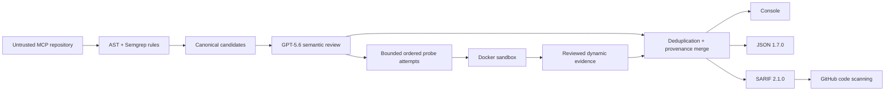

# PortunusMCP Sentinel

## Current v34 correction and regression approval checkpoint

The DDG fixed-request correction is implemented at **`a50e9b7`**. SENT-015
follows source-established HTTPX `build_request` → `send`, retaining a narrow
initial shared-space (`100.64.0.0/10`) rejection qualification on the same caller
URL. Removing/bypassing the guard or replacing/escaping the request loses that
qualification in synthetic controls. Known IP type inspection preserves valid
facts; local module/package shadows, replaced classes/imported attributes and
unknown mutation stay conservative.
The old six negative IP flags alone no longer establish CGNAT rejection. Broader
destinations, subsequent transformations, DNS, redirects and IPv6 remain unproven.

Current engineering passes at **`8a3db58`**: **2,280 tests / 36 skips** locally
and in all **12 supported hosted suites**, **89.87%** local branch coverage,
all **29 normal CI jobs** and docs. Ruff/format/strict mypy, lock/schema/notices,
offline artifacts, installed-wheel/Docker/isolation/hooks and exact package-source
checks pass. All **six production requests regenerate and replay with zero paid
calls**. The initial candidate's full-suite failure, failed/cancelled CI jobs,
additional replacement control, disk exhaustion and interrupted verification are
retained, including the local-module identity failure after the earlier full pass.
The final import-binding correction passes a new full suite and hosted matrix.

**Actual corrected DDG coverage is not yet evaluated.** The exact proposal at
`artifacts/phase22/integration/v34-import-binding/evaluation-proposal.json`
requires separate approval: **87 native observations**, one serial local macOS
sequence, **zero comparator runs, retries, profiles, paid calls or corpus target
executions**. The five unchanged DDG inputs run twice (10), 15 Python development
inputs once, and 31 Python historical inputs twice (62). The target is 120 seconds,
the uniform native/whole-input maximum 300 seconds, cleanup at most 15 seconds,
and sequence maximum 480 minutes. Execution/identity/schema/cleanup/timing/repeat
failure closes all unused observations; detector outcomes are retained for source
assessment. No old budget is reopened.

The gate requires actual fixed-source `send` coverage with initial CGNAT rejection
evidence, both vulnerable detections per DDG batch, unchanged Python named
conditions and **36 entire ordered repeats**. Source-sensitive synthetic controls
are separate engineering evidence. All changed findings and diagnostics require
source assessment. Preserve the two nominal fixed Meta operator erratum inputs,
each with its retained two matched keys, separately from the seven valid Python
development negatives. The unchanged TypeScript paths support reuse of the prior
54-observation compatibility and ten-observation Lighthouse results at `f85a90f`.
Historical whole 25 + 45 + 45 Linux timing remains measured at `1f3f72f`; these
partial checks will not be pooled into a new whole-batch result.

The original **DDG fresh detection at `f85a90f` remains immutable**: two correlated
vulnerable hits in each native batch, zero matching negative alerts and five
ordered repeats; fixed request/guard recognition was unresolved. The correction
follows source exposure and is an exposed regression, not another unseen success.
Original Lighthouse fresh misses, original held-out misses and all earlier failed
attempts remain preserved. Git campaigns stay **312/1,040 incomplete**, as requested.
Paid benchmark/pilots remain deferred; Phase 21 incomplete and Phase 24/15 unchanged.

The current audit accounts for **89 original requirements** (69 passed, two
user-deferred, 18 pending current-source regression/acceptance) and **94 added
rows** (87 passed, five historical proposed limitations, two unresolved). The
pending original rows converge on this regression and its assessments. **Phase 22
remains incomplete** until the actual remaining gates, explicit human technical
acceptance and verified final closeout delivery. No merge, ready-state, release,
outreach or Phase 23 is authorized.


[](https://pypi.org/project/portunusmcp-sentinel/)
[](https://github.com/BashaarJavaid/MCP-Sentinel/actions/workflows/ci.yml)
[](https://bashaarjavaid.github.io/MCP-Sentinel/)

**Build-time security scanning for MCP servers.**

PortunusMCP Sentinel scans local MCP server source before deployment. It combines
deterministic Python and TypeScript analysis, GPT-5.6 semantic review, optional
Docker-isolated runtime probes, OWASP Agentic Top 10 mappings, and validated
SARIF output for GitHub code scanning.

## Install

Sentinel supports Python 3.10–3.13 on Linux, macOS, and Windows. Install the
current package with [pipx](https://pipx.pypa.io/):

```bash
pipx install portunusmcp-sentinel
```

Or use uv:

```bash
uv tool install portunusmcp-sentinel
```

Rules-only commands below require **1.3.0 or newer**. Upgrade an existing install
with `pipx upgrade portunusmcp-sentinel` or `uv tool upgrade portunusmcp-sentinel`.

Reports expose observed handlers and recognition gaps, actual rule visits,
per-session runtime catalogs and sent attacks, and separate static/dynamic review
activity. Default findings include bounded evidence and repair guidance. Static
surface totals remain unknown; zero findings are not proof of safety. See the
[coverage and schema compatibility guide](docs/sarif.md#coverage-and-review-activity-native-160).
Phase 22 adds bounded imported handlers/schemas and containment flows;
computed registrations and unresolved source forms remain coverage gaps.
Permission sidecars express intended grants; they do not enforce runtime
boundaries. The Phase 22 integration source schedules bounded rounds across discovered
tools and supported fields (24 started attempts or 120 seconds by default).
Native 1.7.0 and campaign verification remain in progress; published releases
and historical evidence retain their recorded versions.

## Quickstart

From a local Python or TypeScript MCP server repository:

```bash
sentinel scan . --rules-only
```

Rules-only needs no model credentials, review cache, network, Docker, target
configuration, or target execution. It ignores inactive LLM settings even when
credentials and endpoint overrides are present. Installation and dependency
auditing need network access separately.

The Phase 22 integration source allows deterministic static analysis up to 300
seconds, with a 120-second performance target. Fast scans return immediately;
expiry remains an incomplete scan. Model review and dynamic budgets are separate.
See the [timing policy](docs/phase22-timeout-policy.md) for measurement limits and
the retained failures; this change is not yet a published release.

Optionally run `sentinel init` afterward to generate a deny-by-default
`sentinel.permissions.yaml`; review scopes before granting them. It never imports
or executes source and needs no main guard or launch inference. Existing files
require `--force` for replacement; symlinks are rejected.

For Python runtime scaffolding, run `sentinel init --dynamic`, then
`sentinel scan . --no-rules-only`. Adding missing runtime configuration preserves
and validates an existing permissions file. Dynamic scans require Docker,
model credentials, source-context transmission, and model cost; dependency
installation also needs network access. TypeScript does not support `--dynamic`.
If generated arguments cannot complete a legitimate tool call, add known valid
[`probe_baselines`](docs/configuration.md#dynamic-outcomes-and-valid-examples) to
`sentinel.target.yaml`; an unsuccessful baseline leaves analysis incomplete.

Exit `0` and exit `1` both mean the scan completed: `0` means no finding reached
the configured threshold, while `1` means at least one did. Exit `2` is a target
or configuration error; exit `3` means analysis was incomplete.

## Analysis tiers

| Tier | Command | Requirements | Result |
|---|---|---|---|
| Rules-only | `sentinel scan . --rules-only` | None beyond Sentinel | Deterministic findings remain `needs_review` and fail-on eligible |
| Static + GPT review | `sentinel scan . --static-only` | `OPENAI_API_KEY` | GPT reviews every selected deterministic candidate |
| Full dynamic proof | `sentinel scan .` | `OPENAI_API_KEY`, Docker, and a Python target | GPT review plus four isolated runtime probes |

`--allow-degraded` permits unavailable review; it still calls the model when a
key is available. Use `--rules-only` to disable review explicitly. Completion
describes the selected analysis tier and does not prove a server is secure.

TypeScript support is static-only and covers `.ts`, `.mts`, and `.cts` sources
using the official MCP SDK v1 and server v2 shapes. JavaScript, TSX, declaration
files and Node execution are outside the supported boundary. Declared uv, npm
and pnpm workspaces support aggregate static scans with root Sentinel settings.
Bounded local imports, package exports and TypeScript source aliases feed
containment and handler inventory. Other rules retain their documented flow
limits. Dynamic targets are individual local Python 3.10–3.12 MCP packages.

Version 1.3.0 includes Phase 16 static-correctness changes: same-file
named-helper execution flows and value-specific validation, authentication,
integrity, and configured-sanitizer checks. Unsupported flows remain unresolved;
see the [rule boundaries](docs/rules.md) and
[verification record](docs/phase16-verification.md).

Phase 17 source changes add validated dynamic baselines, explicit probe outcomes,
and proof-preserving review in native JSON 1.6.0. The current replay bundle uses
one approved runtime-review refresh and four unchanged static captures. See the
[Phase 17 verification record](docs/phase17-verification.md) for gates and acceptance status.

This integration source emits native JSON 1.7.0 with ordered runtime attempts
and workspace coverage. Final Phase 22 verification and acceptance remain open;
historical reports and release evidence retain their recorded schema versions.

## Rules

Every finding uses a stable rule ID and maps to the OWASP Agentic Top 10.

| Rule | Detection | OWASP | Impact |
|---|---|---|---|
| [SENT-001](docs/rules.md#sent-001) | Overly broad tool permission scope | ASI03:2026 | High |
| [SENT-002](docs/rules.md#sent-002) | Tool input reaches unsafe execution | ASI05:2026 | Critical |
| [SENT-003](docs/rules.md#sent-003) | Missing tool input validation | ASI02:2026 | Medium |
| [SENT-004](docs/rules.md#sent-004) | Unsanitized tool content enters a prompt | ASI01:2026 | High |
| [SENT-005](docs/rules.md#sent-005) | Hardcoded credential | ASI03:2026 | Critical |
| [SENT-006](docs/rules.md#sent-006) | Missing or ineffective route authentication | ASI03:2026 | High |
| [SENT-007](docs/rules.md#sent-007) | Unverified tool manifest | ASI04:2026 | Medium |
| [SENT-008](docs/rules.md#sent-008) | Out-of-scope tool execution | ASI02:2026 | Critical |
| [SENT-009](docs/rules.md#sent-009) | Size-limit breach or observed OOM/crash | ASI05:2026 | Medium |
| [SENT-010](docs/rules.md#sent-010) | Injection payload executed | ASI05:2026 | Critical |
| [SENT-011](docs/rules.md#sent-011) | Malformed schema input processed | ASI02:2026 | Low |
| [SENT-012](docs/rules.md#sent-012) | Path containment failure | ASI02:2026 | High |
| [SENT-013](docs/rules.md#sent-013) | Tool-description poisoning | ASI01:2026 | High |
| [SENT-014](docs/rules.md#sent-014) | Command option injection | ASI05:2026 | Critical |
| [SENT-015](docs/rules.md#sent-015) | Server-side request forgery | ASI02:2026 | High |
| [SENT-016](docs/rules.md#sent-016) | Unauthorized operator-credential fallback | ASI03:2026 | High |

Published IDs are compatibility contracts: an ID is never renumbered or reused
for a different detection. The [rule catalog](docs/rules.md) documents each
engine, boundary, false-positive risk, evidence, and remediation.

## GitHub Action

The Marketplace Action runs the full Python pipeline, validates SARIF before
upload, and preserves Sentinel's exit contract.

```yaml
name: PortunusMCP Sentinel

on:
  pull_request:
  push:
    branches: [main]

permissions:
  contents: read
  security-events: write

jobs:
  sentinel:
    runs-on: ubuntu-latest
    steps:
      - uses: actions/checkout@v6
      - id: sentinel
        uses: BashaarJavaid/MCP-Sentinel@v1
        with:
          target-path: .
          fail-on: high
          openai-api-key: ${{ secrets.OPENAI_API_KEY }}
```

The Action exposes `sarif-path`, `findings-count`, and `highest-severity`.
Forked pull requests, where secrets are withheld, run visibly degraded analysis
and skip upload. High-assurance consumers can replace `@v1` with the immutable
commit SHA for the selected release.

## Architecture


```mermaid
flowchart LR
    A[Untrusted MCP repository] --> B[AST + Semgrep rules]
    B --> C[Canonical candidates]
    C --> D[GPT-5.6 semantic review]
    D --> E[Bounded ordered probe attempts]
    E --> F[Docker sandbox]
    F --> G[Reviewed dynamic evidence]
    D --> H[Deduplication + provenance merge]
    G --> H
    H --> I[Console]
    H --> J[JSON 1.7.0]
    H --> K[SARIF 2.1.0]
    K --> L[GitHub code scanning]
```

Static analysis never imports or executes target code. GPT receives bounded,
redacted context and can only review existing candidates or order four permanent
inert probes. Dynamic analysis mounts local Python source read-only in fresh
containers with no runtime network, resource limits, and forced cleanup. All
stages feed one canonical Finding model consumed by console, JSON, and SARIF.

PortunusMCP Sentinel is the build-time plane of the PortunusMCP family. The
[PortunusMCP Gateway](https://github.com/BashaarJavaid/PortunusMCP) provides
runtime enforcement in a separate repository, while PortunusMCP Identity is the
separate short-lived credential-broker plane. Neither is required by Sentinel.

## Configuration and adoption

Configuration precedence is CLI → `SENTINEL_*` environment → target-root
`sentinel.toml` → built-in defaults. A normal full scan also requires
`sentinel.target.yaml` and `sentinel.permissions.yaml`; `--static-only` does not
require launch configuration.

Create a baseline from a complete native JSON report, then compare later scans:

```bash
sentinel scan . --allow-degraded --format json --output sentinel-baseline.json
sentinel scan . --allow-degraded --baseline sentinel-baseline.json
```

Matched findings remain visible but do not affect `--fail-on`. Sentinel never
updates a baseline automatically.

Suppress a reviewed static source finding with a reason-bearing directive:

```python
# sentinel: ignore[SENT-005] reason=test credential is inert and rotated
api_key = "ghp_example"
```

Only static `SENT-001`–`SENT-007` and `SENT-012`–`SENT-016` findings can be suppressed. Applied
suppressions remain visible in every report; malformed, duplicate, unknown-rule,
or reasonless directives fail configuration validation.

Use Sentinel from pre-commit:

```yaml
repos:
  - repo: https://github.com/BashaarJavaid/MCP-Sentinel
    rev: v1.3.0
    hooks:
      - id: mcp-sentinel
```

See the [configuration guide](https://bashaarjavaid.github.io/MCP-Sentinel/configuration/)
for LLM endpoint trust, rule selection, baselines, suppressions, and pre-commit.

## CLI and report reference

```bash
# Full static, GPT, and Docker analysis
sentinel scan ./path/to/server

# Static analysis with required GPT review
sentinel scan ./path/to/server --static-only

# Validated SARIF
sentinel scan ./path/to/server --format sarif --output results.sarif

# Select rules and change the failure threshold
sentinel scan ./path/to/server --rules SENT-001,SENT-005 --fail-on critical

# Exercise the packaged reference pipeline
sentinel demo --replay-review --verbose
```

`--fail-on` accepts `critical`, `high`, `medium`, `low`, or `informational`.
Console output is the default; `--format json` and `--format sarif` are stable
machine-readable paths. Validate reports offline with:

```bash
python -m sentinel.schema check
python -m sentinel.report.validate_sarif results.sarif
```

The production reviewer uses GPT-5.6 Sol through the Responses API with
`store: false`, medium reasoning effort, strict Structured Outputs, bounded
context, and host-validated evidence. Sentinel's public OpenAI cost calculation
uses the rates recorded on 2026-09-04: $4/M input, $0.40/M cached input, and
$20/M output, with cache writes at 1.25× input. See the official
[GPT-5.6 Sol model and pricing page](https://developers.openai.com/api/docs/models/gpt-5.6-sol)
and [Responses API create reference](https://developers.openai.com/api/reference/cli/resources/responses/methods/create).
Compatible endpoints retain token usage but report pricing as unavailable.

## Project resources

- [Scan a real MCP server before release](https://bashaarjavaid.github.io/MCP-Sentinel/walkthrough/)
- [Marketplace Action](https://github.com/marketplace/actions/mcp-sentinel)
- [Documentation](https://bashaarjavaid.github.io/MCP-Sentinel/)
- [Architecture contract](ARCHITECTURE.md)
- [Roadmap](ROADMAP.md)
- [Contributing](CONTRIBUTING.md)
- [SARIF guide](https://bashaarjavaid.github.io/MCP-Sentinel/sarif/)
- [Changelog](CHANGELOG.md)
- [Security policy](SECURITY.md)
- [Project history](docs/hackathon.md)

PortunusMCP Sentinel is MIT licensed. Dependency licenses and packaged notices
are recorded in [THIRD_PARTY_NOTICES.md](THIRD_PARTY_NOTICES.md).
