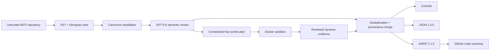

# Architecture

PortunusMCP Sentinel is a build-time pipeline with one canonical Finding model
and three analysis tiers.

## Trust boundaries

The target repository is untrusted. Static analysis reads source but never
imports or executes it, never follows symlinks, and never reads above the scan
root. TypeScript analysis never invokes Node or package scripts.

GPT is an external data boundary. Sentinel sends only bounded, redacted source
context with `store: false`. Model output is untrusted: strict Structured
Outputs parsing and host-side evidence/probe validation run before it can affect
a finding. GPT cannot create rule-less findings or executable probe code.

Docker is the only target execution boundary. Each approved inert probe runs
against a local Python target in a fresh container with read-only source,
restricted build egress, no runtime network, stripped environment, resource
limits, and forced cleanup.

Reports are security artifacts. Incomplete static, GPT, dynamic, or validation
stages cannot silently become an empty successful report. Console, JSON, and
SARIF all consume the same deduplicated Finding objects.

The complete field, state-transition, sandbox, configuration, and failure
contracts live in the root [architecture
contract](https://github.com/BashaarJavaid/MCP-Sentinel/blob/main/ARCHITECTURE.md).
