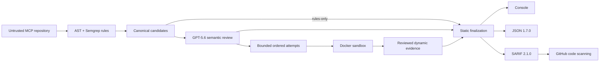

# Architecture

PortunusMCP Sentinel is a build-time pipeline with one canonical Finding model
and three analysis tiers.

Rules-only explicitly skips GPT and Docker, including clients, review cache,
network calls, and runtime configuration. Reports complete for that selected
tier with null reviews and skipped-stage reasons. Completion is not assurance
that a server is secure. The default reviewed and dynamic pipeline is preserved.

## Trust boundaries

The target repository is untrusted. Static analysis reads source but never
imports or executes it, never follows symlinks, and never reads above the scan
root. TypeScript analysis never invokes Node or package scripts.

Helm YAML templates under a chart's `templates/` directory remain available to
text/secret checks. Each template reports `static_helm_template_unparsed` because
structured YAML analysis is omitted; Sentinel does not render charts. Ordinary
YAML and Sentinel configuration remain strict. Static analysis retains its
120-second deadline.

GPT is an external data boundary. Sentinel sends only bounded, redacted source
context with `store: false`. Model output is untrusted: strict Structured
Outputs parsing and host-side evidence/probe validation run before it can affect
a finding. GPT cannot create rule-less findings or executable probe code.

Docker is the only target execution boundary. Each approved inert probe runs
against a local Python target in a fresh container with read-only source,
restricted build egress, no runtime network, stripped environment, resource
limits, and forced cleanup. Separate baseline and attack containers are required per
attempt. The default campaign permits 24 started attempts or 120 seconds,
including runtime discovery; incomplete remainders remain visible. This Phase 22
integration contract is still under verification.

Reports are security artifacts. Incomplete static, GPT, dynamic, or validation
stages cannot silently become an empty successful report. Console, JSON, and
SARIF all consume the same deduplicated Finding objects.

## Independent benchmark

The [accepted Phase 20 baseline](phase20-acceptance.md) measures deterministic,
reviewed, and eligible runtime behavior on frozen independent cases. Findings
count only when they identify the labeled security condition; unrelated warnings
remain unadjudicated. Candidate recall, retained alerts, confirmed-only alerts,
coverage, incomplete execution, and review cost are reported separately.

The [Phase 22 technical contract](phase22-technical.md) records the authorized
expansion and its pending evidence/approval gates. Phase 20 inputs are now exposed
regression evidence; Phase 21 and Phase 22's pilot acceptance remain incomplete.

The complete field, state-transition, sandbox, configuration, and failure
contracts live in the root [architecture
contract](https://github.com/BashaarJavaid/MCP-Sentinel/blob/main/ARCHITECTURE.md).
